# TVSETTINGS L2 Low Level Test Specification and Procedure Documentation

## Table of Contents

- [Overview](#overview)
- [Acronyms, Terms and Abbreviations](#acronyms-terms-and-abbreviations)
- [Definitions](#definitions)
- [References](#references)
- [Level 2 Test Procedure](#level-2-test-procedure)

## Overview

This document describes the Low level L2 Test Specification and Procedure Documentation for the TVSETTINGS module.

### Acronyms, Terms and Abbreviations

- `HAL` \- Hardware Abstraction Layer, may include some common components
- `UT`  \- Unit Test(s)
- `OEM`  \- Original Equipment Manufacture
- `SoC`  \- System on a Chip

### Definitions

- `ut-core` \- Common Testing Framework <https://github.com/rdkcentral/ut-core>, which wraps a open-source framework that can be expanded to the requirements for future framework.

### References

- `High Level Test Specification` - [tv-settings_High_Level_Test_Spec.md](https://github.com/rdkcentral/rdkv-halif-test-tvsettings/blob/main/docs/pages/tv-settings_High_Level_Test_Spec.md)
- `HAL Interface file` - [tv-settings_header](https://github.com/rdkcentral/rdkv-halif-tvsettings/blob/main/include/tvSettings.h)

## Level 2 Test Procedure

The following functions are expecting to test the module operates correctly.

### Test 1

|Title|Details|
|--|--|
|Function Name|`test_l2_tvSettings_GetSupportedVideoFormats`|
|Description|Get TV supported video formats and verify that the test provides all supported video formats and their count (minimum is 1 and maximum is VIDEO_FORMAT_MAX). Compare the test results with the platform-supported configurations file  using the path 'tvSettings/VideoFormat/index' and loop through the indices. Using the path 'tvSettings/VideoFormat/numberOfFormats' compare the count.|
|Test Group|02|
|Test Case ID|001|
|Priority|High|

**Pre-Conditions**
None

**Dependencies**
None

**User Interaction**
If user chose to run the test in interactive mode, then the test case has to be selected via console.

#### Test Procedure  - Test 1

| Variation / Steps | Description | Test Data | Expected Result | Notes|
| -- | --------- | ---------- | -------------- | ----- |
| 01 | Initialize TV using TvInit | None | tvERROR_NONE | Should be successful |
| 02 | Get supported video formats using GetTVSupportedVideoFormats | videoFormats = valid buffer, numberOfFormats = valid buffer | tvERROR_NONE | Should be successful |
| 03 | Verify the number of formats | numberOfFormats = valid buffer | tvERROR_NONE | Should be successful |
| 04 | Loop through the indices and verify each video format | videoFormats[i] = valid buffer | tvERROR_NONE | Should be successful |
| 05 | Terminate TV using TvTerm | None | tvERROR_NONE | Should be successful |

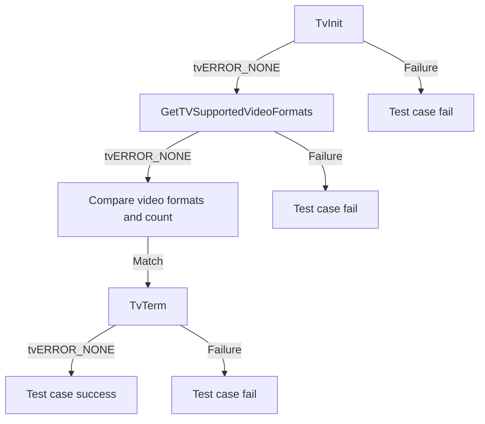
```mermaid
graph TB
    A[TvInit] -->|tvERROR_NONE| B[GetTVSupportedVideoFormats]
    A -->|Failure| A1[Test case fail]
    B -->|tvERROR_NONE| C[Compare video formats and count]
    B -->|Failure| B1[Test case fail]
    C -->|Match| D[TvTerm]
    D -->|tvERROR_NONE| E[Test case success]
    D -->|Failure| D1[Test case fail]
```

### Test 2

|Title|Details|
|--|--|
|Function Name|`test_l2_tvSettings_GetCurrentVideoFormat_NoVideoPlayback`|
|Description|Verify getting the current video format when there is no video playback. Default is VIDEO_FORMAT_SDR|
|Test Group|02|
|Test Case ID|002|
|Priority|High|

**Pre-Conditions**
None

**Dependencies**
None

**User Interaction**
If user chose to run the test in interactive mode, then the test case has to be selected via console.

#### Test Procedure  - Test 2

| Variation / Steps | Description | Test Data | Expected Result | Notes|
| -- | --------- | ---------- | -------------- | ----- |
| 01 | Invoke TvInit with no input parameters | None | tvERROR_NONE | Should be successful |
| 02 | Invoke GetCurrentVideoFormat with valid pointer to tvVideoFormatType_t variable and verify value | videoFormat = valid pointer | tvERROR_NONE, VIDEO_FORMAT_SDR | Should be successful |
| 03 | Invoke TvTerm with no input parameters | None | tvERROR_NONE | Should be successful |

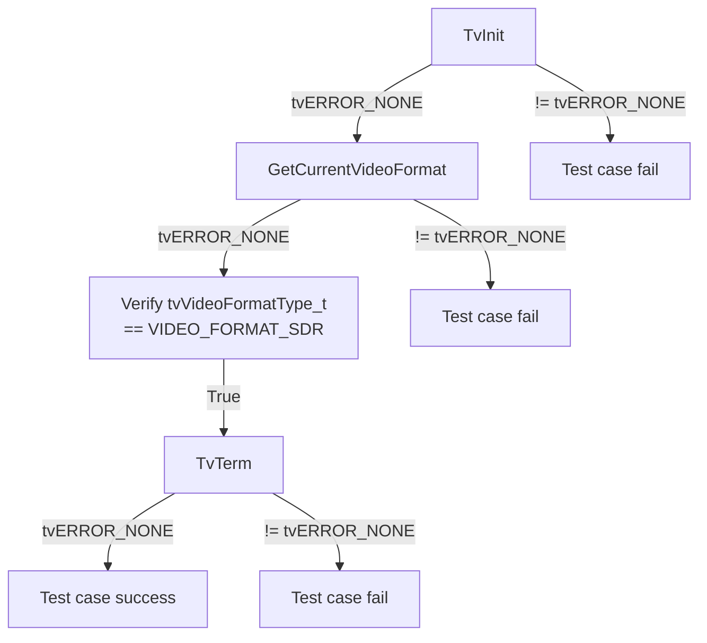
```mermaid
graph TB
A[TvInit] -->|tvERROR_NONE| B[GetCurrentVideoFormat]
A -->|!= tvERROR_NONE| A1[Test case fail]
B -->|tvERROR_NONE| C[Verify tvVideoFormatType_t <br> == VIDEO_FORMAT_SDR]
B -->|!= tvERROR_NONE| B1[Test case fail]
C -->|True| D[TvTerm]
D -->|tvERROR_NONE| E[Test case success]
D -->|!= tvERROR_NONE| D1[Test case fail]
```

### Test 3

|Title|Details|
|--|--|
|Function Name|`test_l2_tvSettings_VerifyCurrentVideoResolution`|
|Description|Verify that the current video resolution of the primary video is 'tvVideoResolution_NONE' when playback has not started or has been stopped.|
|Test Group|02|
|Test Case ID|003|
|Priority|High|

**Pre-Conditions**
None

**Dependencies**
None

**User Interaction**
If user chose to run the test in interactive mode, then the test case has to be selected via console.

#### Test Procedure  - Test 3

| Variation / Steps | Description | Test Data | Expected Result | Notes|
| -- | --------- | ---------- | -------------- | ----- |
| 01 | Initialize the TV using TvInit | None | tvERROR_NONE | Should be successful |
| 02 | Get the current video resolution using GetCurrentVideoResolution | res = valid buffer | tvERROR_NONE | Should be successful |
| 03 | Check if the resolution value is 'tvVideoResolution_NONE' | resolutionValue = tvVideoResolution_NONE | tvVideoResolution_NONE | Should be successful |
| 04 | Check if the frame height is 0 | frameHeight = 0 | 0 | Should be successful |
| 05 | Check if the frame width is 0 | frameWidth = 0 | 0 | Should be successful |
| 06 | Check if the video is not interlaced | isInterlaced = 0 | 0 | Should be successful |
| 07 | Terminate the TV using TvTerm | None | tvERROR_NONE | Should be successful |

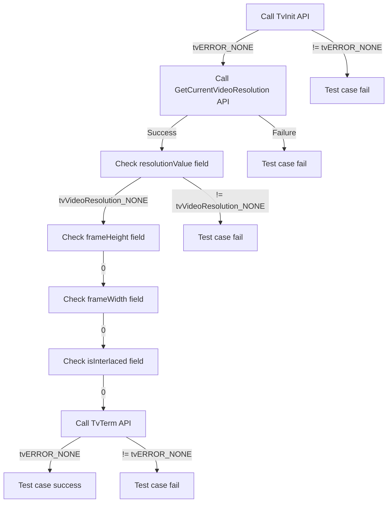
```mermaid
graph TB
    TvInit[Call TvInit API] -->|tvERROR_NONE| GetCurrentVideoResolution
    TvInit -->|!= tvERROR_NONE| TestcaseFail1[Test case fail]
    GetCurrentVideoResolution[Call GetCurrentVideoResolution API] -->|Success| CheckResolutionValue
    GetCurrentVideoResolution -->|Failure| TestcaseFail2[Test case fail]
    CheckResolutionValue[Check resolutionValue field] -->|tvVideoResolution_NONE| CheckFrameHeight
    CheckResolutionValue -->|!= tvVideoResolution_NONE| TestcaseFail3[Test case fail]
    CheckFrameHeight[Check frameHeight field] -->|0| CheckFrameWidth
    CheckFrameWidth[Check frameWidth field] -->|0| CheckIsInterlaced
    CheckIsInterlaced[Check isInterlaced field] -->|0| TvTerm
    TvTerm[Call TvTerm API] -->|tvERROR_NONE| TestcaseSuccess[Test case success]
    TvTerm -->|!= tvERROR_NONE| TestcaseFail7[Test case fail]
```

### Test 4

|Title|Details|
|--|--|
|Function Name|`test_l2_tvSettings_VerifyFrameRateWhenStopped`|
|Description|Verify that the default video frame rate is 'tvVideoFrameRate_NONE' when there is no playback.|
|Test Group|02|
|Test Case ID|004|
|Priority|High|

**Pre-Conditions**
None

**Dependencies**
None

**User Interaction**
If user chose to run the test in interactive mode, then the test case has to be selected via console.

#### Test Procedure  - Test 4

| Variation / Steps | Description | Test Data | Expected Result | Notes|
| -- | --------- | ---------- | -------------- | ----- |
| 01 | Initialize the TV using TvInit | None | tvERROR_NONE | Should be successful |
| 02 | Get the current video frame rate using GetCurrentVideoFrameRate  and verify the value| frameRate = valid buffer | tvERROR_NONE, frameRate = tvVideoFrameRate_NONE | Should be successful |
| 03 |Terminate the TV using TvTerm | None | tvERROR_NONE | Should be successful |

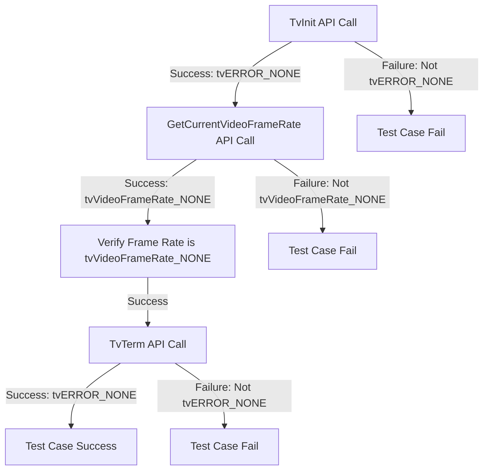
```mermaid
graph TB
A[TvInit API Call] -->|Success: tvERROR_NONE| B[GetCurrentVideoFrameRate API Call]
A -->|Failure: Not tvERROR_NONE| A1[Test Case Fail]
B -->|Success: tvVideoFrameRate_NONE| C[Verify Frame Rate is tvVideoFrameRate_NONE]
B -->|Failure: Not tvVideoFrameRate_NONE| B1[Test Case Fail]
C -->|Success| D[TvTerm API Call]
D -->|Success: tvERROR_NONE| E[Test Case Success]
D -->|Failure: Not tvERROR_NONE| D1[Test Case Fail]
```

### Test 5

|Title|Details|
|--|--|
|Function Name|`test_l2_tvSettings_GetTVSupportedVideoSources`|
|Description|Get TV Supported Video Sources - Verify the test provides all supported video sources and their count( Min is 1 and Max is VIDEO_SOURCE_MAX). Compare the test results with the platform-supported configurations file  using the path 'tvSettings/VideoSource/index' and loop through the indices, using the path 'tvSettings/VideoSource/numberOfFormats' compare the count.|
|Test Group|02|
|Test Case ID|005|
|Priority|High|

**Pre-Conditions**
None

**Dependencies**
None

**User Interaction**
If user chose to run the test in interactive mode, then the test case has to be selected via console.

#### Test Procedure  - Test

| Variation / Steps | Description | Test Data | Expected Result | Notes|
| -- | --------- | ---------- | -------------- | ----- |
| 01 | Initialize TV using TvInit() | None | tvERROR_NONE | Should be successful |
| 02 | Get supported video sources and their count using GetTVSupportedVideoSources() | videoSources = valid buffer, numberOfSources = valid buffer | tvERROR_NONE | Should be successful |
| 03 | Verify the number of sources is between 1 and VIDEO_SOURCE_MAX | numberOfSources = returned value | True | Should be successful |
| 04 | Loop through the indices and compare the test results with the platform-supported configurations file using the path 'tvSettings/VideoSource/index' | videoSources[i] = returned value, key = "tvSettingsVideoSource/index/i" | True | Should be successful |
| 05 | Terminate TV using TvTerm() | None | tvERROR_NONE | Should be successful |

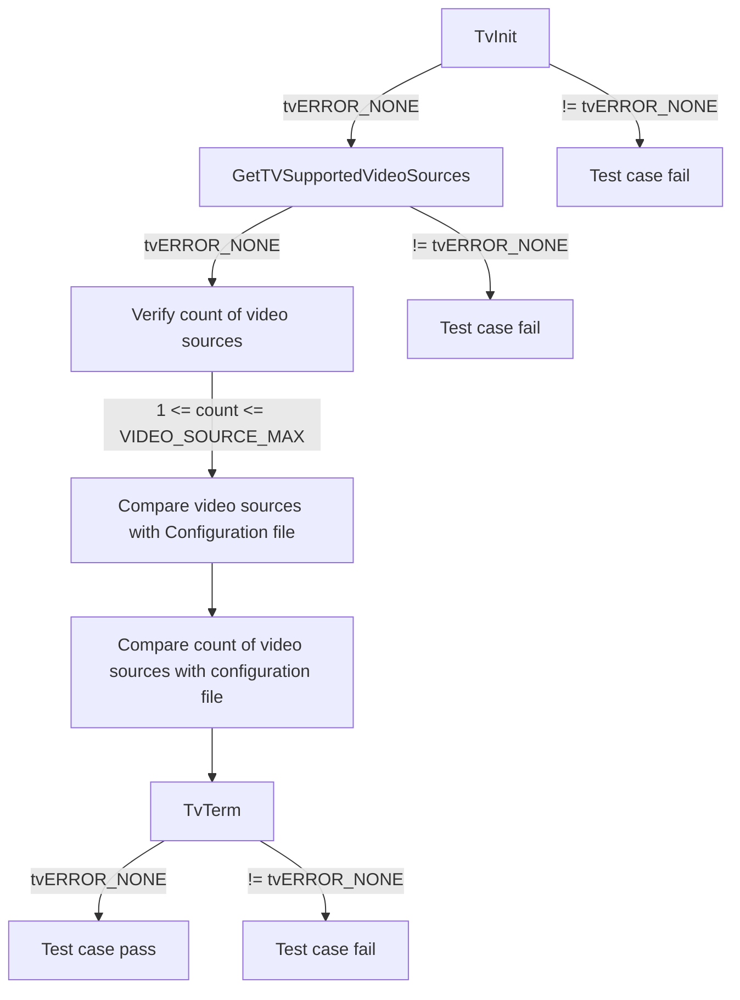
```mermaid
graph TB
    A[TvInit] -->|tvERROR_NONE| B[GetTVSupportedVideoSources]
    A -->|!= tvERROR_NONE| A1[Test case fail]
    B -->|tvERROR_NONE| C[Verify count of video sources]
    B -->|!= tvERROR_NONE| B1[Test case fail]
    C -->|1 <= count <= VIDEO_SOURCE_MAX| D[Compare video sources with Configuration file]
    D --> E[Compare count of video sources with configuration file]
    E --> F[TvTerm]
    F -->|tvERROR_NONE| G[Test case pass]
    F -->|!= tvERROR_NONE| F1[Test case fail]
```

### Test 6

|Title|Details|
|--|--|
|Function Name|`test_l2_tvSettings_VerifyNoVideoSource`|
|Description|Verify when there is no video source device is connected. Default is VIDEO_SOURCE_IP|
|Test Group|02|
|Test Case ID|006|
|Priority|High|

**Pre-Conditions**
None

**Dependencies**
None

**User Interaction**
If user chose to run the test in interactive mode, then the test case has to be selected via console.

#### Test Procedure  - Test 6

| Variation / Steps | Description | Test Data | Expected Result | Notes|
| -- | --------- | ---------- | -------------- | ----- |
| 01 | Invoke TvInit() to initialize the TV | None | tvERROR_NONE | Should be successful |
| 02 | Invoke GetCurrentVideoSource() with valid pointer to get the current video source | currentSource = valid pointer | tvERROR_NONE, VIDEO_SOURCE_IP | Should be successful |
| 03 | Invoke TvTerm() to terminate the TV | None | tvERROR_NONE | Should be successful |

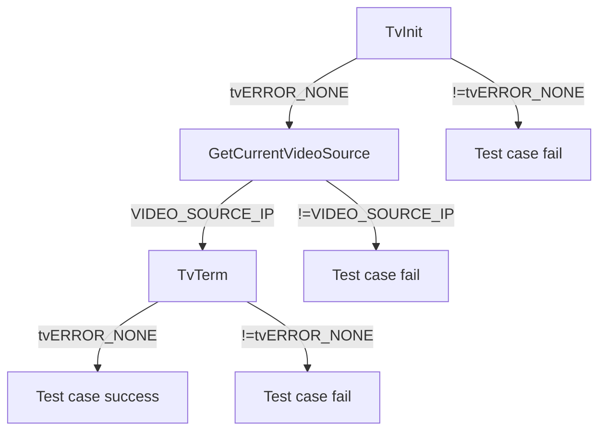
```mermaid
graph TB
    A[TvInit] -->|tvERROR_NONE| B[GetCurrentVideoSource]
    A -->|!=tvERROR_NONE| A1[Test case fail]
    B -->|VIDEO_SOURCE_IP| C[TvTerm]
    B -->|!=VIDEO_SOURCE_IP| B1[Test case fail]
    C -->|tvERROR_NONE| D[Test case success]
    C -->|!=tvERROR_NONE| C1[Test case fail]
```

### Test 7

|Title|Details|
|--|--|
|Function Name|`test_l2_tvSettings_SetAndGetBacklight`|
|Description|Sets and Gets the backlight within the valid range (0 - 100). The retrieved value should match the set value. Get values are retrieved from the `PQ` database.|
|Test Group|02|
|Test Case ID|007|
|Priority|High|

**Pre-Conditions**
None

**Dependencies**
None

**User Interaction**
If user chose to run the test in interactive mode, then the test case has to be selected via console.

#### Test Procedure  - Test 7

| Variation / Steps | Description | Test Data | Expected Result | Notes|
| -- | --------- | ---------- | -------------- | ----- |
| 01 | Initialize the TV using TvInit() | None | tvERROR_NONE | Should be successful |
| 02 | Set the backlight value using SetBacklight() | backlight = 0,25,50,75,100 | tvERROR_NONE | Should be successful |
| 03 | Get the backlight value using GetBacklight() and verify with set value | getBacklight = valid buffer | tvERROR_NONE, backlight = 0,25,50,75,100 | Should be successful |
| 04 | Terminate the TV using TvTerm() | None | tvERROR_NONE | Should be successful |

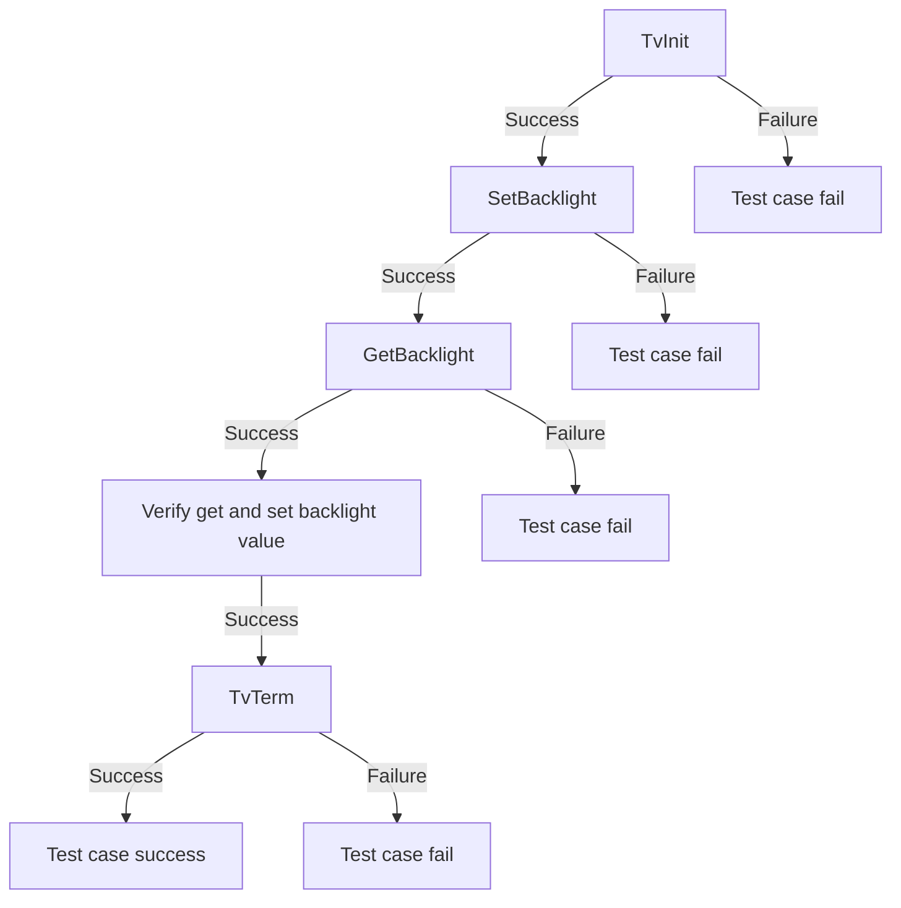
```mermaid
graph TB
A[TvInit] -->|Success| B[SetBacklight]
A -->|Failure| A1[Test case fail]
B -->|Success| D[GetBacklight]
B -->|Failure| B1[Test case fail]
D -->|Success| F[Verify get and set backlight value]
D -->|Failure| D1[Test case fail]
F -->|Success| G[TvTerm]
G -->|Success| H[Test case success]
G -->|Failure| G1[Test case fail]
```

### Test 8

|Title|Details|
|--|--|
|Function Name|`test_l2_tvSettings_SetAndGetBacklightFade`|
|Description|Set and Gets the Back light fade within the valid ranges of from ( 0  - 100 ), to ( 0 - 100 ), current( 0 - 100) and duration (0 - 10000 ms). The retrieved value should match the set value. Get values are retrieved from the `PQ` database.|
|Test Group|02|
|Test Case ID|008|
|Priority|High|

**Pre-Conditions**
None

**Dependencies**
None

**User Interaction**
If user chose to run the test in interactive mode, then the test case has to be selected via console.

#### Test Procedure  - Test 8

| Variation / Steps | Description | Test Data | Expected Result | Notes|
| -- | --------- | ---------- | -------------- | ----- |
| 01 | Initialize the TV using TvInit() | None | tvERROR_NONE | Should be successful |
| 02 | Set the Backlight Fade using SetBacklightFade() with 5 different values | from = value(0-100), to = value(0-100) , duration = value(0-10000) | tvERROR_NONE | Should be successful |
| 03 | Get the current Backlight Fade using GetCurrentBacklightFade() | get_from, get_to, get_current | tvERROR_NONE | Should be successful |
| 04 | Validate the set and get values of from , to, duration |  | from = get_from, to = get_to, get_current between 0 to 100 | Should be successful |
| 05 | Terminate the TV using TvTerm() | None | tvERROR_NONE | Should be successful |

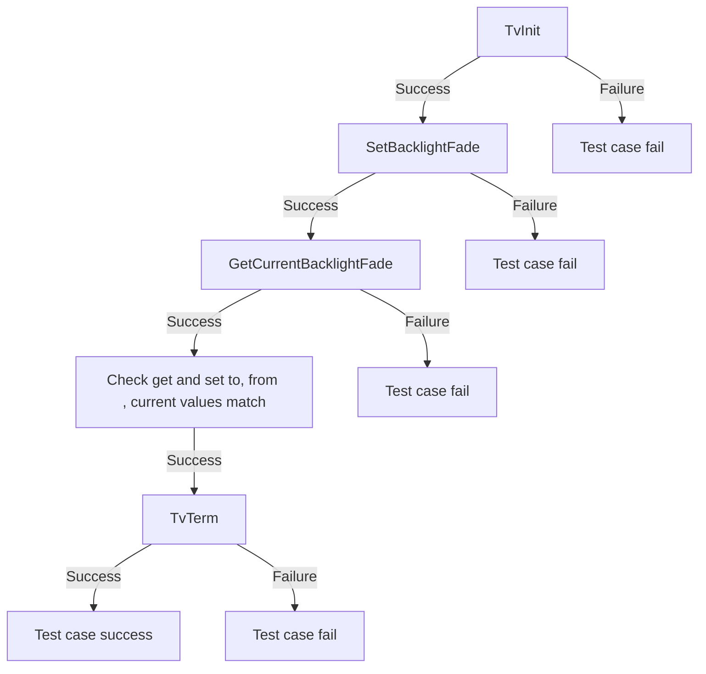
```mermaid
graph TB
A[TvInit] -->|Success| B[SetBacklightFade]
A -->|Failure| A1[Test case fail]
B -->|Success| D[GetCurrentBacklightFade]
B -->|Failure| B1[Test case fail]
D -->|Success| F[Check get and set to, from , current values match]
D -->|Failure| D1[Test case fail]
F -->|Success| G[TvTerm]
G -->|Success| H[Test case success]
G -->|Failure| G1[Test case fail]
```

### Test 9

|Title|Details|
|--|--|
|Function Name|`test_l2_tvSettings_GetSupportedBacklightModes`|
|Description|Get Supported Back light Modes - verifies to get all the supported backlight modes. Compare the test results with the platform-supported configurations file  using the path 'tvSettings/BacklightControl/index' and loop through the indices.|
|Test Group|02|
|Test Case ID|009|
|Priority|High|

**Pre-Conditions**
None

**Dependencies**
None

**User Interaction**
If user chose to run the test in interactive mode, then the test case has to be selected via console.

#### Test Procedure  - Test 9

| Variation / Steps | Description | Test Data | Expected Result | Notes|
| -- | --------- | ---------- | -------------- | ----- |
| 01 | Initialize the TV using TvInit | None | tvERROR_NONE | Should be successful |
| 02 | Get the supported backlight modes using GetSupportedBacklightModes | blModes = valid pointer | tvERROR_NONE | Should be successful |
| 03 | Compare the obtained backlight modes with the platform-supported configurations file | blModes, "tvSettings/BacklightControl/index" | None | Should be successful |
| 04 | Terminate the TV using TvTerm | None | tvERROR_NONE | Should be successful |

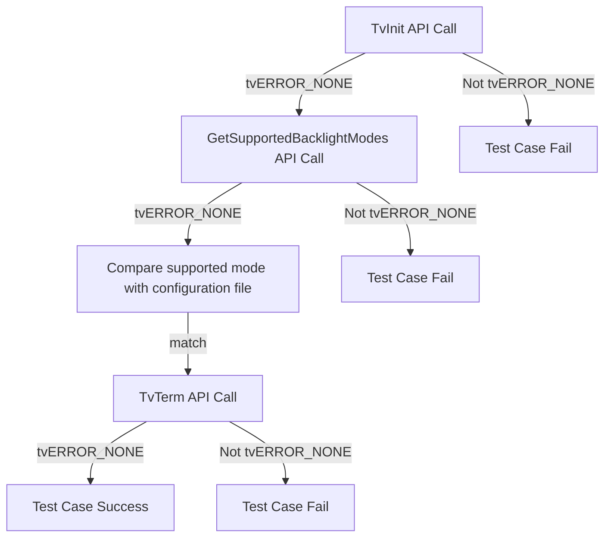
```mermaid
graph TB
    A[TvInit API Call] -->|tvERROR_NONE| B[GetSupportedBacklightModes API Call]
    A -->|Not tvERROR_NONE| A1[Test Case Fail]
    B -->|tvERROR_NONE| C[Compare supported mode with configuration file]
    B -->|Not tvERROR_NONE| B1[Test Case Fail]
    C -->|match| D[TvTerm API Call]
    D -->|tvERROR_NONE| E[Test Case Success]
    D -->|Not tvERROR_NONE| D1[Test Case Fail]
```

### Test 10

|Title|Details|
|--|--|
|Function Name|`test_l2_tvSettings_SetAndGetBacklightMode`|
|Description|Set and Gets the current Back light modes. The retrieved value should match the set value. Get values are retrieved from the `PQ` database.|
|Test Group|02|
|Test Case ID|10|
|Priority|High|

**Pre-Conditions**
None

**Dependencies**
None

**User Interaction**
If user chose to run the test in interactive mode, then the test case has to be selected via console.

#### Test Procedure  - Test 10

| Variation / Steps | Description | Test Data | Expected Result | Notes|
| -- | --------- | ---------- | -------------- | ----- |
| 01 | Initialize TV using TvInit() | None | tvERROR_NONE | Should be successful |
| 02 | Set current backlight mode using SetCurrentBacklightMode() | setMode = Backlight modes from GetSupportedBacklightModes | tvERROR_NONE | Should be successful |
| 03 | Get current backlight mode using GetCurrentBacklightMode() | getMode = valid buffer | tvERROR_NONE | Should be successful |
| 04 | Validate the set and get backlight modes are same | setMode, getMode | setMode should be equal to getMode | Should be successful |
| 05 | Terminate TV using TvTerm() | None | tvERROR_NONE | Should be successful |

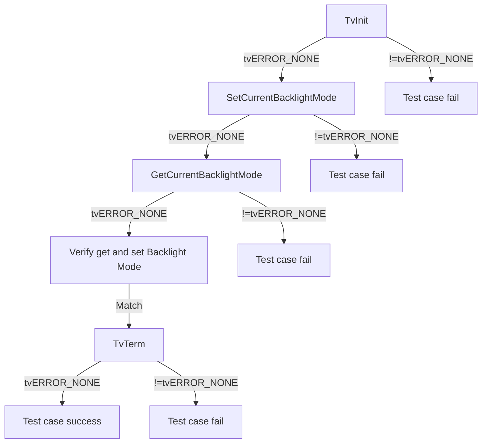
```mermaid
graph TB
A[TvInit] -->|tvERROR_NONE| B[SetCurrentBacklightMode]
A -->|!=tvERROR_NONE| A1[Test case fail]
B -->|tvERROR_NONE| C[GetCurrentBacklightMode]
B -->|!=tvERROR_NONE| B1[Test case fail]
C -->|tvERROR_NONE| D[Verify get and set Backlight Mode]
C -->|!=tvERROR_NONE| C1[Test case fail]
D -->|Match| E[TvTerm]
E -->|tvERROR_NONE| F[Test case success]
E -->|!=tvERROR_NONE| E1[Test case fail]
```

### Test 11

|Title|Details|
|--|--|
|Function Name|`test_l2_tvSettings_GetSupportedDimmingModes`|
|Description|Gets TV Supported Dimming Modes - Verify the test provides all supported backlight dimming modes and their count( Min is 1 and Max is tvDimmingMode_MAX). Compare the test results with the platform-supported configurations file  using the path 'tvSettings/DimmingMode/index' and loop through the indices.|
|Test Group|02|
|Test Case ID|011|
|Priority|High|

**Pre-Conditions**
None

**Dependencies**
None

**User Interaction**
If user chose to run the test in interactive mode, then the test case has to be selected via console.

#### Test Procedure  - Test 11

| Variation / Steps | Description | Test Data | Expected Result | Notes|
| -- | --------- | ---------- | -------------- | ----- |
| 01 | Invoke TvInit with no input parameters | None | tvERROR_NONE | Should be successful |
| 02 | Invoke GetTVSupportedDimmingModes with valid output parameters | dimmingModes = valid buffer, numDimmingModes = valid buffer | tvERROR_NONE | Should be successful |
| 03 | Compare the number of dimming modes with the platform-supported configurations file | numDimmingModes = value from GetTVSupportedDimmingModes | Equal to the value in 'tvSettings/DimmingMode/index' of  | Should be successful |
| 04 | Invoke TvTerm with no input parameters | None | tvERROR_NONE | Should be successful |

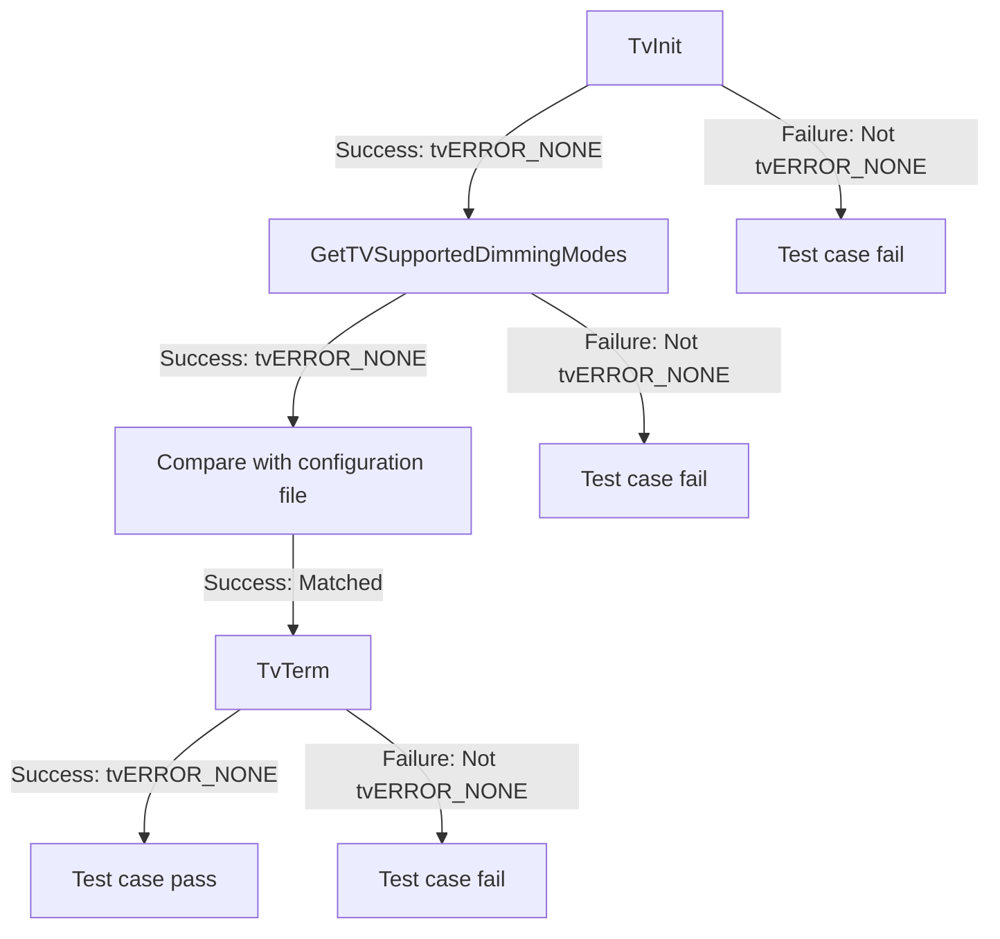
```mermaid
graph TB
    A[TvInit] -->|Success: tvERROR_NONE| B[GetTVSupportedDimmingModes]
    A -->|Failure: Not tvERROR_NONE| A1[Test case fail]
    B -->|Success: tvERROR_NONE| C[Compare with configuration file]
    B -->|Failure: Not tvERROR_NONE| B1[Test case fail]
    C -->|Success: Matched| D[TvTerm]
    D -->|Success: tvERROR_NONE| E[Test case pass]
    D -->|Failure: Not tvERROR_NONE| D1[Test case fail]
```

### Test 12

|Title|Details|
|--|--|
|Function Name|`test_l2_tvSettings_SetAndGetDimmingMode`|
|Description|Set and Gets the TV Dimming modes. The retrieved value should match the set value. Get values are retrieved from the `PQ` database.|
|Test Group|02|
|Test Case ID|12|
|Priority|High|

**Pre-Conditions**
None

**Dependencies**
None

**User Interaction**
If user chose to run the test in interactive mode, then the test case has to be selected via console.

#### Test Procedure  - Test 12

| Variation / Steps | Description | Test Data | Expected Result | Notes|
| -- | --------- | ---------- | -------------- | ----- |
| 01 | Initialize the TV using TvInit | None | tvERROR_NONE | Should be successful |
| 02 | Set the TV Dimming mode to "local" using SetTVDimmingMode | dimmingMode = "local","fixed","global" | tvERROR_NONE | Should be successful |
| 03 | Get the TV Dimming mode using GetTVDimmingMode | getDimmingMode = valid buffer | tvERROR_NONE | Should be successful |
| 04 | Verify the set and get Dimming mode are same |  | getDimmingMode = dimmingMode  | Should be successful |
| 05 | Terminate the TV using TvTerm | None | tvERROR_NONE | Should be successful |

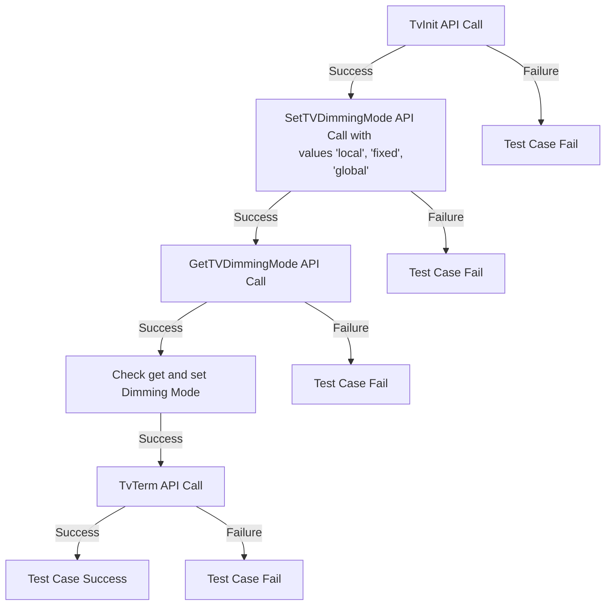
```mermaid
graph TB
A[TvInit API Call] -->|Success| B[SetTVDimmingMode API Call with <br> values 'local', 'fixed', 'global']
A -->|Failure| A1[Test Case Fail]
B -->|Success| D[GetTVDimmingMode API Call]
B -->|Failure| B1[Test Case Fail]
D -->|Success| F[Check get and set Dimming Mode]
D -->|Failure| D1[Test Case Fail]
F -->|Success| G[TvTerm API Call]
G -->|Success| H[Test Case Success]
G -->|Failure| G1[Test Case Fail]
```

### Test 13

|Title|Details|
|--|--|
|Function Name|`test_l2_tvSettings_SetAndGetLocalDimmingLevel`|
|Description|Set and Gets the local Dimming level. The retrieved value should match the set value. Get values are retrieved from the database.|
|Test Group|02|
|Test Case ID|013|
|Priority|High|

**Pre-Conditions**
None

**Dependencies**
None

**User Interaction**
If user chose to run the test in interactive mode, then the test case has to be selected via console.

#### Test Procedure  - Test 13

| Variation / Steps | Description | Test Data | Expected Result | Notes|
| -- | --------- | ---------- | -------------- | ----- |
| 01 | Initialize the TV using TvInit() | None | tvERROR_NONE | Should be successful |
| 02 | Set the local dimming level using SetLocalDimmingLevel() for each level in ldimStateLevels[] | ldimStateLevel = LDIM_STATE_NONBOOST, LDIM_STATE_BOOST, LDIM_STATE_BURST | tvERROR_NONE | Should be successful |
| 03 | Get the local dimming level using GetLocalDimmingLevel() | None | tvERROR_NONE | Should be successful |
| 04 | Assert that the set and retrieved local dimming levels are equal | None | ldimStateLevel = ldimStateLevelGet | Should be successful |
| 05 | Terminate the TV using TvTerm() | None | tvERROR_NONE | Should be successful |

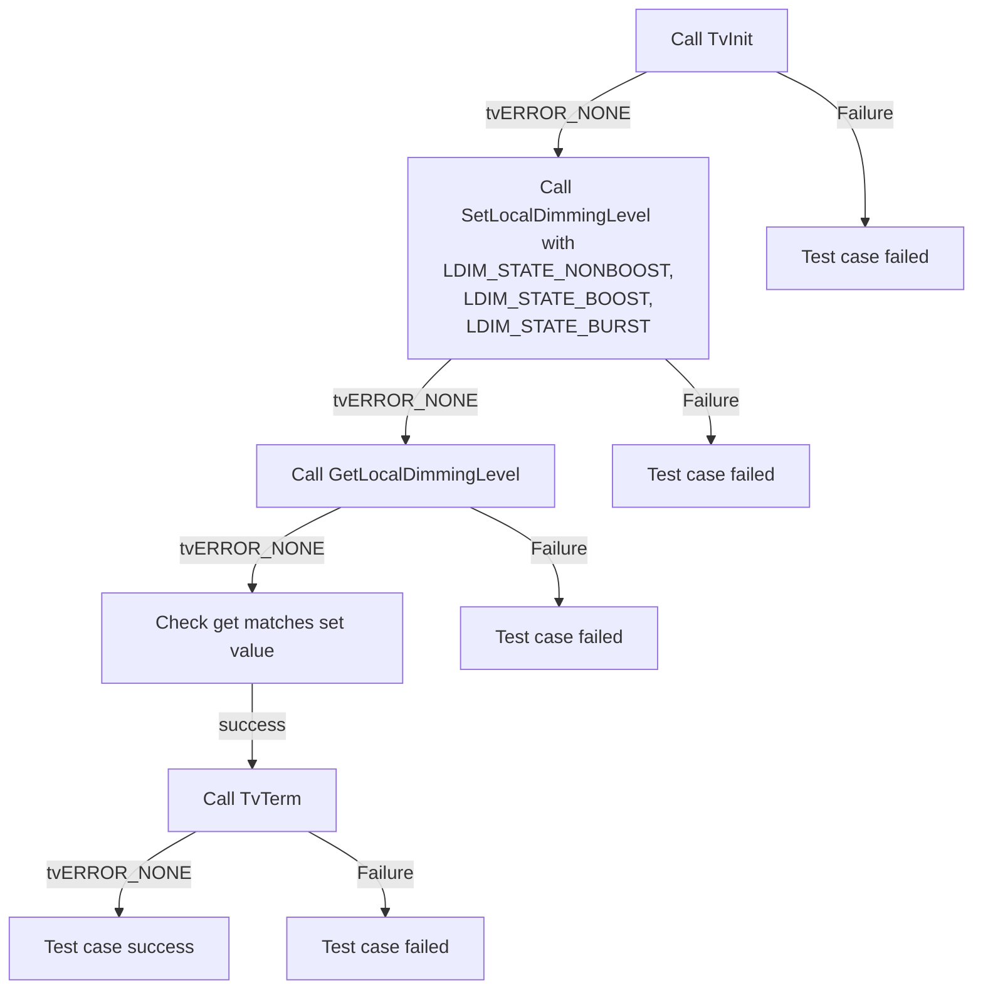
```mermaid
graph TB
    TvInit[Call TvInit] -->|tvERROR_NONE| SetLocalDimmingLevel1
    TvInit -->|Failure| TestcaseFail1[Test case failed]
    SetLocalDimmingLevel1[Call SetLocalDimmingLevel <br> with LDIM_STATE_NONBOOST,<br> LDIM_STATE_BOOST, LDIM_STATE_BURST] -->|tvERROR_NONE| GetLocalDimmingLevel1
    SetLocalDimmingLevel1 -->|Failure| TestcaseFail2[Test case failed]
    GetLocalDimmingLevel1[Call GetLocalDimmingLevel] -->|tvERROR_NONE| Verify1
    GetLocalDimmingLevel1 -->|Failure| TestcaseFail3[Test case failed]
    Verify1[Check get matches set value] -->|success| TvTerm
    TvTerm[Call TvTerm] -->|tvERROR_NONE| TestCaseSuccess[Test case success]
    TvTerm -->|Failure| TestcaseFail8[Test case failed]
```

### Test 14

|Title|Details|
|--|--|
|Function Name|`test_l2_tvSettings_SetAndGetBrightness`|
|Description|Set and Gets the brightness within the valid range ( 0 - 100 ). The retrieved value should match the set value. Get values are retrieved from the database.|
|Test Group|02|
|Test Case ID|14|
|Priority|High|

**Pre-Conditions**
None

**Dependencies**
None

**User Interaction**
If user chose to run the test in interactive mode, then the test case has to be selected via console.

#### Test Procedure  - Test 14

| Variation / Steps | Description | Test Data | Expected Result | Notes|
| -- | --------- | ---------- | -------------- | ----- |
| 01 | Initialize the TV using TvInit | None | tvERROR_NONE | Should be successful |
| 02 | Set the brightness using SetBrightness for 4 different values | brightness = (0-100) | tvERROR_NONE | Should be successful |
| 03 | Get the brightness using GetBrightness | get_brightness = valid buffer | tvERROR_NONE | Should be successful |
| 04 | Validate the set and get brightness values are equal | brightness = get_brightness  | Equal | Should be successful |
| 05 | Terminate the TV using TvTerm | None | tvERROR_NONE | Should be successful |

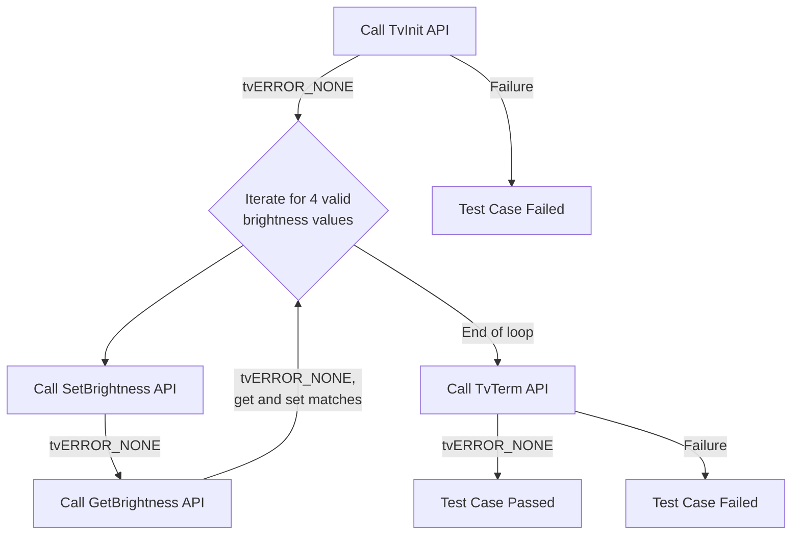
```mermaid
graph TB
    Step1[Call TvInit API]-->|tvERROR_NONE| Step3{Iterate for 4 valid <br> brightness values }
    Step3 -->Step2[Call SetBrightness API]
    Step1 -->|Failure| Fail1[Test Case Failed]
    Step2 -->|tvERROR_NONE| Step4[Call GetBrightness API]
    Step4 -->|tvERROR_NONE,<br> get and set matches| Step3
    Step3 -->|End of loop| Step6[Call TvTerm API]
    Step6 -->|tvERROR_NONE| End[Test Case Passed]
    Step6 -->|Failure| Fail6[Test Case Failed]
```

### Test 15

|Title|Details|
|--|--|
|Function Name|`test_l2_tvSettings_SetAndGetContrast`|
|Description|Set and Gets the contrast within the valid range ( 0 - 100 ). The retrieved value should match the set value. Get values are retrieved from the database.|
|Test Group|02|
|Test Case ID|15|
|Priority|High|

**Pre-Conditions**
None

**Dependencies**
None

**User Interaction**
If user chose to run the test in interactive mode, then the test case has to be selected via console.

#### Test Procedure  - Test 15

| Variation / Steps | Description | Test Data | Expected Result | Notes|
| -- | --------- | ---------- | -------------- | ----- |
| 01 | Initialize the TV using TvInit() | None | tvERROR_NONE | Should be successful |
| 02 | Set the contrast using SetContrast() for 4 different values | contrast =  (0-100) | tvERROR_NONE | Should be successful |
| 03 | Get the contrast using GetContrast() | getContrast = valid buffer | tvERROR_NONE | Should be successful |
| 04 | Check if the set and get contrast values match |  |  getContrast = contrast | Should be successful |
| 05 | Terminate the TV using TvTerm() | None | tvERROR_NONE | Should be successful |

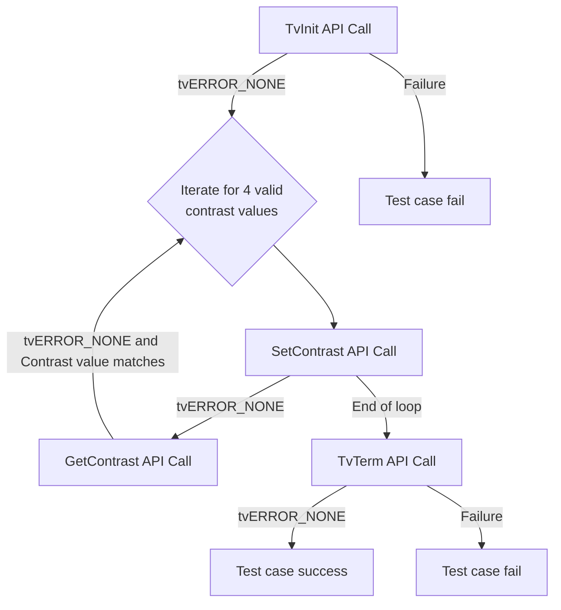
```mermaid
graph TB
A[TvInit API Call] -->|tvERROR_NONE| Step1{Iterate for 4 valid <br> contrast values }
Step1 --> B[SetContrast API Call]
A -->|Failure| A1[Test case fail]
B -->|tvERROR_NONE| C[GetContrast API Call]
C -->|tvERROR_NONE and Contrast value matches| Step1
B -->|End of loop|D[TvTerm API Call]
D -->|tvERROR_NONE| E[Test case success]
D -->|Failure| D1[Test case fail]
```

### Test 16

|Title|Details|
|--|--|
|Function Name|`test_l2_tvSettings_SetAndGetSharpness`|
|Description|Set and Gets the sharpness ( 0 - 100 ). The retrieved value should match the set value. Get values are retrieved from the database.|
|Test Group|02|
|Test Case ID|16|
|Priority|High|

**Pre-Conditions**
None

**Dependencies**
None

**User Interaction**
If user chose to run the test in interactive mode, then the test case has to be selected via console.

#### Test Procedure  - Test 16

| Variation / Steps | Description | Test Data | Expected Result | Notes|
| -- | --------- | ---------- | -------------- | ----- |
| 01 | Initialize the TV using TvInit() | None | tvERROR_NONE | Should be successful |
| 02 | Set the sharpness using SetSharpness() for 4 different values | setSharpness = (0-100) | tvERROR_NONE | Should be successful |
| 03 | Get the sharpness using GetSharpness() | getSharpness = valid buffer | tvERROR_NONE | Should be successful |
| 04 | Assert that the set sharpness and the retrieved sharpness are equal |  | setSharpness = getSharpness | Should be successful |
| 05 | Terminate the TV using TvTerm() | None | tvERROR_NONE | Should be successful |

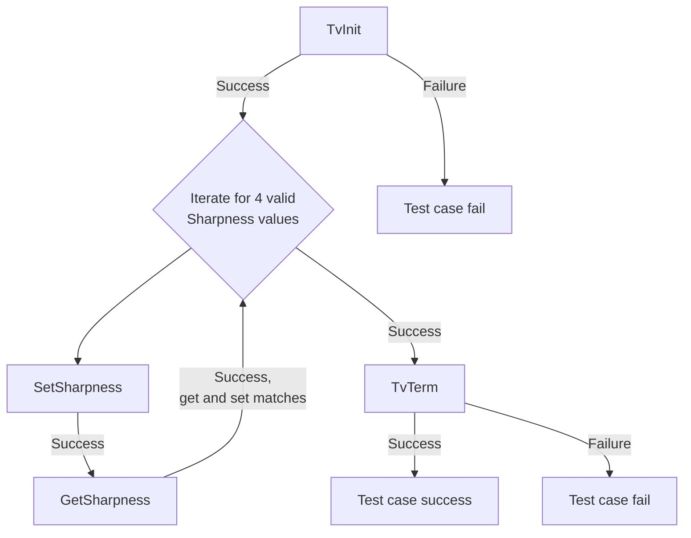
```mermaid
graph TB
A[TvInit] -->|Success| Loop{Iterate for 4 valid <br> Sharpness values}
Loop --> B[SetSharpness]
A -->|Failure| A1[Test case fail]
B -->|Success| D[GetSharpness]
D -->|Success, <br> get and set matches| Loop
Loop -->|Success| G[TvTerm]
G -->|Success| H[Test case success]
G -->|Failure| G1[Test case fail]
```

### Test 17

|Title|Details|
|--|--|
|Function Name|`test_l2_tvSettings_SetAndGetSaturation`|
|Description|Set and Gets the saturation within the valid range ( 0 - 100 ). The retrieved value should match the set value. Get values are retrieved from the database.|
|Test Group|02|
|Test Case ID|17|
|Priority|High|

**Pre-Conditions**
None

**Dependencies**
None

**User Interaction**
If user chose to run the test in interactive mode, then the test case has to be selected via console.

#### Test Procedure  - Test 17

| Variation / Steps | Description | Test Data | Expected Result | Notes|
| -- | --------- | ---------- | -------------- | ----- |
| 01 | Initialize the TV using TvInit() | None | tvERROR_NONE | Should be successful |
| 02 | Set the saturation value using SetSaturation() for 4 different values| saturation_set = (0-100) | tvERROR_NONE | Should be successful |
| 03 | Get the saturation value using GetSaturation() | saturation_get = valid buffer | tvERROR_NONE | Should be successful |
| 04 | Compare the set and get saturation values | | saturation_set = saturation_get | Should be successful |
| 05 | Terminate the TV using TvTerm() | None | tvERROR_NONE | Should be successful |

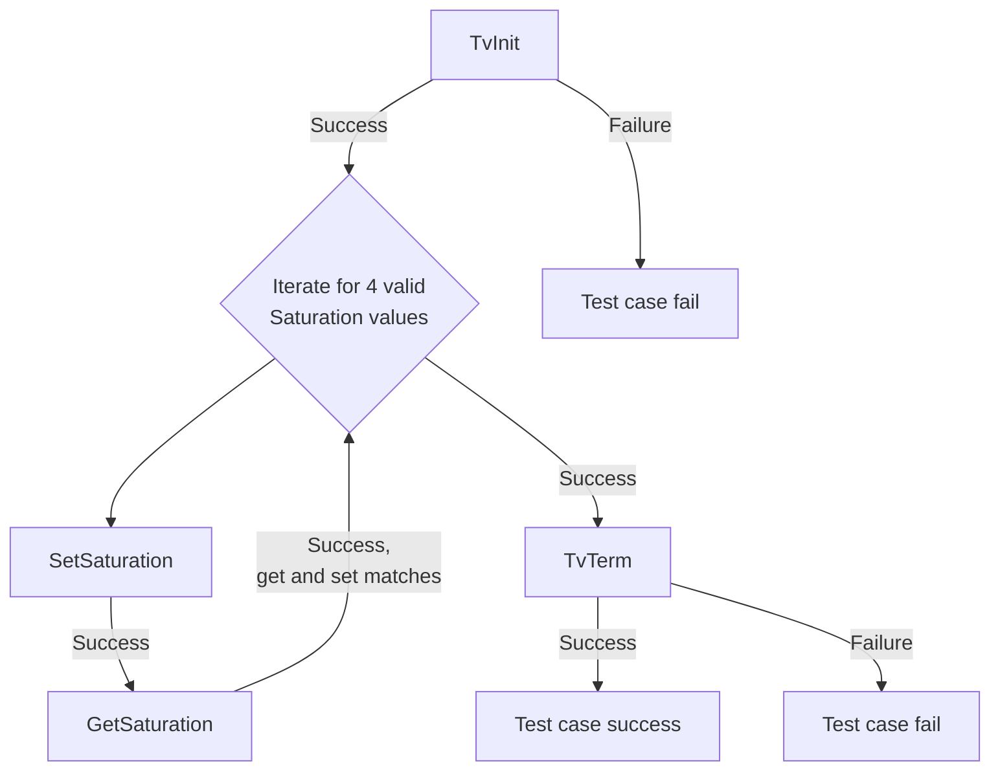
```mermaid
graph TB
A[TvInit] -->|Success| Loop{Iterate for 4 valid <br> Saturation values}
Loop --> B[SetSaturation]
A -->|Failure| A1[Test case fail]
B -->|Success| D[GetSaturation]
D -->|Success, <br> get and set matches| Loop
Loop -->|Success| G[TvTerm]
G -->|Success| H[Test case success]
G -->|Failure| G1[Test case fail]
```

### Test 18

|Title|Details|
|--|--|
|Function Name|`test_l2_tvSettings_SetAndGetHue`|
|Description|Set and Gets the Hue ( 0 - 100 ). The retrieved value should match the set value. Get values are retrieved from the database.|
|Test Group|02|
|Test Case ID|018|
|Priority|High|

**Pre-Conditions**
None

**Dependencies**
None

**User Interaction**
If user chose to run the test in interactive mode, then the test case has to be selected via console.

#### Test Procedure  - Test 18

| Variation / Steps | Description | Test Data | Expected Result | Notes|
| -- | --------- | ---------- | -------------- | ----- |
| 01 | Initialize the TV using TvInit | None | tvERROR_NONE | Should be successful |
| 02 | Set the Hue using SetHue for 4 different values| hue = (0-100) | tvERROR_NONE | Should be successful |
| 03 | Get the Hue using GetHue | getHue = valid buffer | tvERROR_NONE | Should be successful |
| 04 | Validate the set and get Hue values are same | | hue = getHue  | Should be successful |
| 05 | Terminate the TV using TvTerm | None | tvERROR_NONE | Should be successful |

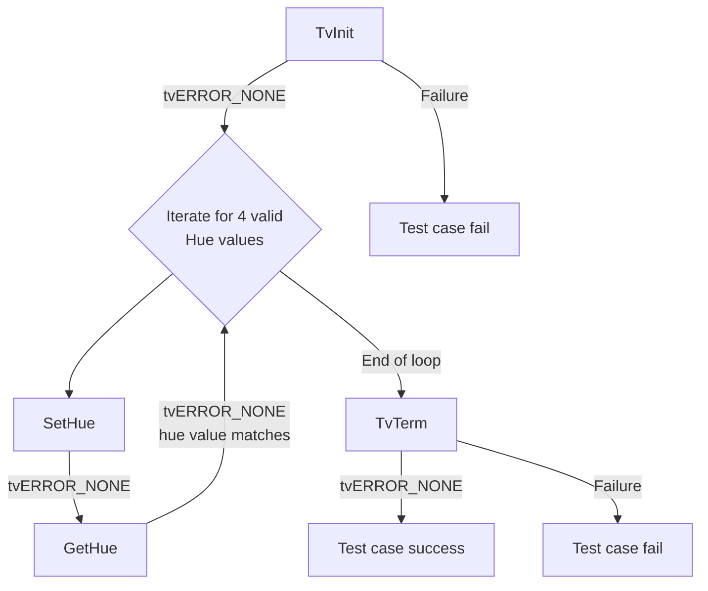
```mermaid
graph TB
    A[TvInit] -->|tvERROR_NONE| Loop{Iterate for 4 valid <br> Hue values}
    Loop --> B[SetHue]
    A -->|Failure| A1[Test case fail]
    B -->|tvERROR_NONE| C[GetHue]
    C -->|tvERROR_NONE <br> hue value matches| Loop
    Loop -->|End of loop|D[TvTerm]
    D -->|tvERROR_NONE| E[Test case success]
    D -->|Failure| D1[Test case fail]
```

### Test 19

|Title|Details|
|--|--|
|Function Name|`test_l2_tvSettings_SetAndGetColorTemperature`|
|Description|Set and Gets the Color Temperature. The retrieved value should match the set value. Get values are retrieved from the database.|
|Test Group|02|
|Test Case ID|19|
|Priority|High|

**Pre-Conditions**
None

**Dependencies**
None

**User Interaction**
If user chose to run the test in interactive mode, then the test case has to be selected via console.

#### Test Procedure  - Test 19

| Variation / Steps | Description | Test Data | Expected Result | Notes|
| -- | --------- | ---------- | -------------- | ----- |
| 01 | Initialize the TV using TvInit | None | tvERROR_NONE | Should be successful |
| 02 | Set various color temperatures using SetColorTemperature | colorTemp = tvColorTemp_STANDARD to tvColorTemp_MAX-1 | tvERROR_NONE | Should be successful |
| 03 | Get the color temperature using GetColorTemperature and verify get and set | getColorTemp = valid buffer | tvERROR_NONE, colorTemp = getColorTemp | Should be successful |
| 04 | Terminate the TV using TvTerm | None | tvERROR_NONE | Should be successful |

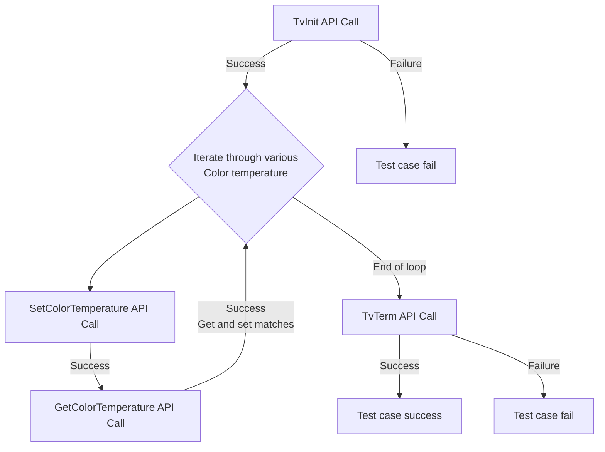
```mermaid
graph TB
    A[TvInit API Call] -->|Success| Loop{Iterate through various <br> Color temperature}
    Loop --> B[SetColorTemperature API Call]
    A -->|Failure| A1[Test case fail]
    B -->|Success| D[GetColorTemperature API Call]
    D -->| Success <br> Get and set matches|Loop
    Loop -->|End of loop| F[TvTerm API Call]
    F -->|Success| G[Test case success]
    F -->|Failure| F1[Test case fail]
```

### Test 20

|Title|Details|
|--|--|
|Function Name|`test_l2_tvSettings_SetAndGetAspectRatio`|
|Description|Set and Gets the Aspect Ratio. The retrieved value should match the set value. Get values are retrieved from the database.|
|Test Group|02|
|Test Case ID|20|
|Priority|High|

**Pre-Conditions**
None

**Dependencies**
None

**User Interaction**
If user chose to run the test in interactive mode, then the test case has to be selected via console.

#### Test Procedure  - Test 20

| Variation / Steps | Description | Test Data | Expected Result | Notes|
| -- | --------- | ---------- | -------------- | ----- |
| 01 | Initialize the TV using TvInit() | None | tvERROR_NONE | Should be successful |
| 02 | Set the Aspect Ratio using SetAspectRatio() for various aspect ratios| setMode = tvDisplayMode_4x3 to tvDisplayMode_MAX-1| tvERROR_NONE | Should be successful |
| 03 | Get the Aspect Ratio using GetAspectRatio() | getMode = valid buffer | tvERROR_NONE | Should be successful |
| 04 | Validate the set and get Aspect Ratio are same |  | setMode=getMode | Should be successful |
| 05 | Terminate the TV using TvTerm() | None | tvERROR_NONE | Should be successful |

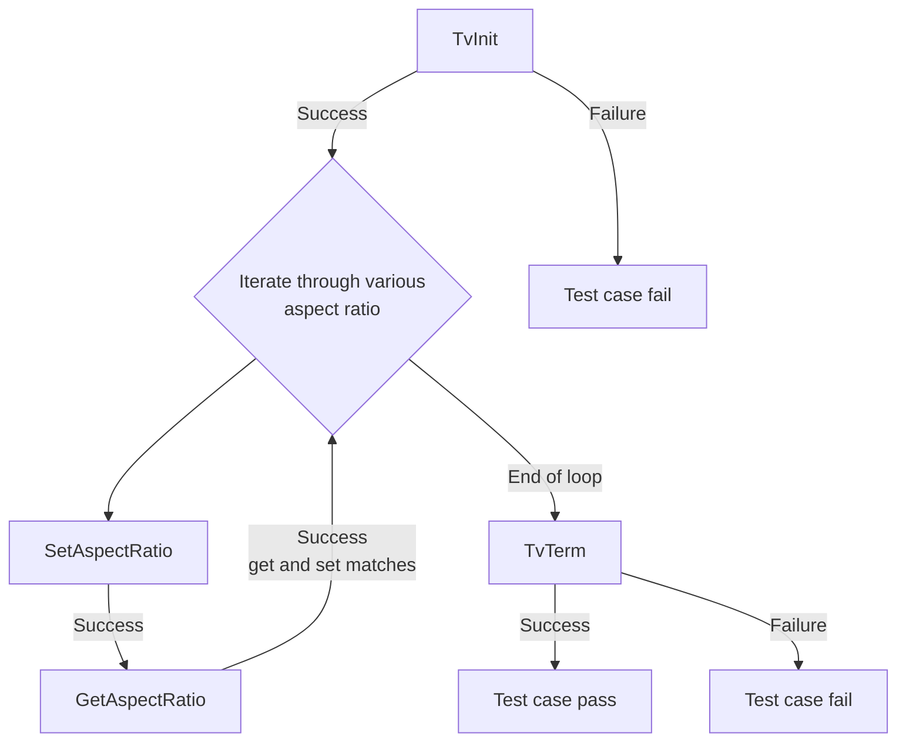
```mermaid
graph TB
    A[TvInit] -->|Success| Loop{Iterate through various <br> aspect ratio}
    Loop --> B[SetAspectRatio]
    A -->|Failure| A1[Test case fail]
    B -->|Success| C[GetAspectRatio]
    C -->|Success <br> get and set matches| Loop
    Loop -->|End of loop|E[TvTerm]
    E -->|Success| F[Test case pass]
    E -->|Failure| E1[Test case fail]
```

### Test 21

|Title|Details|
|--|--|
|Function Name|`test_l2_tvSettings_SetAndGetLowLatencyState`|
|Description|Set and Gets the Low Latency State ( 0 for disable and 1 for enable ). The retrieved value should match the set value. Get values are retrieved from the database.|
|Test Group|02|
|Test Case ID|021|
|Priority|High|

**Pre-Conditions**
None

**Dependencies**
None

**User Interaction**
If user chose to run the test in interactive mode, then the test case has to be selected via console.

#### Test Procedure  - Test 21

| Variation / Steps | Description | Test Data | Expected Result | Notes|
| -- | --------- | ---------- | -------------- | ----- |
| 01 | Initialize TV using TvInit() | None | tvERROR_NONE | Should be successful |
| 02 | Set Low Latency State to 1 using SetLowLatencyState(1) | LowLatencyState = 1 | tvERROR_NONE | Should be successful |
| 03 | Get Low Latency State using GetLowLatencyState() and verify the value| lowlatencystate = valid buffer | tvERROR_NONE, lowlatencystate = 1 | Should be successful |
| 04 | Set Low Latency State to 0 using SetLowLatencyState(0) | LowLatencyState = 0 | tvERROR_NONE | Should be successful |
| 05 | Get Low Latency State using GetLowLatencyState() and verify the value| lowlatencystate = valid buffer | tvERROR_NONE, lowlatencystate = 0 | Should be successful |
| 06 | Terminate TV using TvTerm() | None | tvERROR_NONE | Should be successful |

```mermaid
graph TB
A[TvInit] -->|tvERROR_NONE| B[SetLowLatencyState with value 1]
B -->|tvERROR_NONE| C[GetLowLatencyState]
C -->|tvERROR_NONE <br> lowlatencystate=1| D[SetLowLatencyState with value 0]
D -->|tvERROR_NONE| E[GetLowLatencyState]
E -->|tvERROR_NONE <br> lowlatencystate=0| F[TvTerm]
F -->|tvERROR_NONE| G[Test case success]
A -->|Failure| A1[Test case fail]
B -->|Failure| B1[Test case fail]
C -->|Failure| C1[Test case fail]
D -->|Failure| D1[Test case fail]
E -->|Failure| E1[Test case fail]
F -->|Failure| F1[Test case fail]
```

### Test 22

|Title|Details|
|--|--|
|Function Name|`test_l2_tvSettings_SetAndGetDynamicContrast`|
|Description|Set and Gets the Dynamic Contrast. The retrieved value should match the set value. Get values are retrieved from the database.|
|Test Group|02|
|Test Case ID|22|
|Priority|High|

**Pre-Conditions**
None

**Dependencies**
None

**User Interaction**
If user chose to run the test in interactive mode, then the test case has to be selected via console.

#### Test Procedure  - Test 22

| Variation / Steps | Description | Test Data | Expected Result | Notes|
| -- | --------- | ---------- | -------------- | ----- |
| 01 | Initialize the TV using TvInit | None | tvERROR_NONE | Should be successful |
| 02 | Set Dynamic Contrast to enabled using SetDynamicContrast | dynamicContrastEnable = "enabled" | tvERROR_NONE | Should be successful |
| 03 | Get the Dynamic Contrast status using GetDynamicContrast and verify| isDynamicContrastEnabled = valid buffer | tvERROR_NONE, isDynamicContrastEnabled = "enabled" | Should be successful |
| 04 | Set Dynamic Contrast to disabled using SetDynamicContrast | dynamicContrastEnable = "disabled" | tvERROR_NONE | Should be successful |
| 05 | Get the Dynamic Contrast status using GetDynamicContrast and verify | isDynamicContrastEnabled = valid buffer | tvERROR_NONE, isDynamicContrastEnabled = "disabled" | Should be successful |
| 06 | Terminate the TV using TvTerm | None | tvERROR_NONE | Should be successful |

```mermaid
graph TB
A[TvInit] -->|tvERROR_NONE| B[SetDynamicContrast <br> with value 'enabled']
B -->|tvERROR_NONE| C[GetDynamicContrast]
C -->|tvERROR_NONE <br> isDynamicContrastEnabled = 'enabled'| D[SetDynamicContrast <br> with value 'disabled']
D -->|tvERROR_NONE| E[GetDynamicContrast]
E -->|tvERROR_NONE <br> isDynamicContrastEnabled = 'disabled'| F[TvTerm]
F --> |tvERROR_NONE| G[Test case success]
A -->|Failure| A1[Test case fail]
B -->|Failure| B1[Test case fail]
C -->|Failure| C1[Test case fail]
D -->|Failure| D1[Test case fail]
E -->|Failure| E1[Test case fail]
F -->|Failure| F1[Test case fail]
```

### Test 23

|Title|Details|
|--|--|
|Function Name|`test_l2_tvSettings_SetAndGetDynamicGamma`|
|Description|Set and Gets the Dynamic Gamma within the valid range ( 1.80 to 2.60 ). The retrieved value should match the set value. Get values are retrieved from the database.|
|Test Group|02|
|Test Case ID|23|
|Priority|High|

**Pre-Conditions**
None

**Dependencies**
None

**User Interaction**
If user chose to run the test in interactive mode, then the test case has to be selected via console.

#### Test Procedure  - Test 23

| Variation / Steps | Description | Test Data | Expected Result | Notes|
| -- | --------- | ---------- | -------------- | ----- |
| 01 | Initialize the TV using TvInit() | None | tvERROR_NONE | Should be successful |
| 02 | Set the Dynamic Gamma using SetDynamicGamma() for different valid values| setGammaValue = 1.80 to 2.6 | tvERROR_NONE | Should be successful |
| 04 | Get the Dynamic Gamma using GetDynamicGamma() | getGammaValue = valid buffer | tvERROR_NONE | Should be successful |
| 05 | Assert that the set and get Gamma values are equal |  | setGammaValue = getGammaValue | Should be successful |
| 06 | Terminate the TV using TvTerm() | None | tvERROR_NONE | Should be successful |

```mermaid
graph TB
    A[TvInit] -->|Success| Loop{Iterate through <br> valid values}
    Loop --> B[SetDynamicGamma]
    A -->|Failure| A1[Test case fail]
    B -->|Success| C[GetDynamicGamma]
    C -->|Success <br> get and set matches| Loop
    Loop --> |End of loop|E[TvTerm]
    E -->|Success| F[Test case success]
    E -->|Failure| E1[Test case fail]
```

### Test 24

|Title|Details|
|--|--|
|Function Name|`test_l2_tvSettings_GetSupportedDolbyVisionModes`|
|Description|Get TV Supported Dolby Vision Modes - Verify the test provides all supported Dolby Vision modes and their count( Min is 0 and Max is tvMode_Max ). Compare the test results with the platform-supported configurations file  using the path 'tvSettings/DolbyVisionMode/index' and loop through the indices.|
|Test Group|02|
|Test Case ID|24|
|Priority|High|

**Pre-Conditions**
None

**Dependencies**
None

**User Interaction**
If user chose to run the test in interactive mode, then the test case has to be selected via console.

#### Test Procedure  - Test 24

| Variation / Steps | Description | Test Data | Expected Result | Notes|
| -- | --------- | ---------- | -------------- | ----- |
| 01 | Initialize TV using TvInit | None | tvERROR_NONE | Should be successful |
| 02 | Invoke GetTVSupportedDolbyVisionModes with valid dvModes and count | dvModes = valid buffer, count = valid buffer | tvERROR_NONE | Should be successful |
| 03 | Check if the count of supported Dolby Vision modes is between 0 and tvMode_Max | count = returned value from GetTVSupportedDolbyVisionModes | count >= 0 and count <= tvMode_Max | Should be successful |
| 04 | Loop through the indices and compare the test results with the platform-supported configurations file using the path 'tvSettings/DolbyVisionMode/index' | dvModes[i] = returned value from GetTVSupportedDolbyVisionModes |  dvModes = value in the platform-supported configurations file | Should be successful |
| 05 | Terminate TV using TvTerm | None | tvERROR_NONE | Should be successful |

```mermaid
graph TB
A[TvInit API Call] -->|tvERROR_NONE| B[GetTVSupportedDolbyVisionModes API Call]
A -->|Failure| A1[Test case fail]
B -->|tvERROR_NONE| D[Loop through array of supported Dolby Vision modes]
B -->|Failure| B1[Test case fail]
D -->|Success| E[TvTerm API Call]
D -->|Failure| D1[Test case fail]
E -->|tvERROR_NONE| F[Test case success]
E -->|Failure| E1[Test case fail]
```

### Test 25

|Title|Details|
|--|--|
|Function Name|`test_l2_tvSettings_SetAndGetDolbyVisionMode`|
|Description|Set and Gets the TV Dolby Vision mode. The retrieved value should match the set value. Get values are retrieved from the database.|
|Test Group|02|
|Test Case ID|025|
|Priority|High|

**Pre-Conditions**
None

**Dependencies**
None

**User Interaction**
If user chose to run the test in interactive mode, then the test case has to be selected via console.

#### Test Procedure  - Test 25

| Variation / Steps | Description | Test Data | Expected Result | Notes|
| -- | --------- | ---------- | -------------- | ----- |
| 01 | Initialize the TV using TvInit | None | tvERROR_NONE | Should be successful |
| 02 | Set the TV Dolby Vision mode using SetTVDolbyVisionMode | dolbyMode = value retrieved from GetTVSupportedDolbyVisionModes. | tvERROR_NONE | Should be successful |
| 03 | Get the TV Dolby Vision mode using GetTVDolbyVisionMode and verify | getDolbyMode = valid buffer | tvERROR_NONE, getDolbyMode = dolbyMode | Should be successful |
| 04 | Terminate the TV using TvTerm | None | tvERROR_NONE | Should be successful |

```mermaid
graph TB
A[TvInit] -->|tvERROR_NONE| Loop{Iterate through supported <br> Dolby Vision Modes }
Loop --> B[SetTVDolbyVisionMode]
A -->|Failure| A1[Test case fail]
B -->|tvERROR_NONE| C[GetTVDolbyVisionMode]
C -->|tvERROR_NONE <br> get and set matches| Loop
Loop -->|End of loop| E[TvTerm]
E -->|tvERROR_NONE| F[Test case pass]
E -->|Failure| E1[Test case fail]
```

### Test 26

|Title|Details|
|--|--|
|Function Name|`test_l2_tvSettings_GetTVSupportedPictureModes`|
|Description|Get TV Supported Picture Modes - Verify the test provides all supported Picture Modes and their count( Min is 1 and Max is PIC_MODES_SUPPORTED_MAX ). Compare the test results with the platform-supported configurations file  using the path 'tvSettings/PictureMode/index' and loop through the indices.|
|Test Group|02|
|Test Case ID|26|
|Priority|High|

**Pre-Conditions**
None

**Dependencies**
None

**User Interaction**
If user chose to run the test in interactive mode, then the test case has to be selected via console.

#### Test Procedure  - Test 26

| Variation / Steps | Description | Test Data | Expected Result | Notes|
| -- | --------- | ---------- | -------------- | ----- |
| 01 | Initialize TV using TvInit | No input parameters | tvERROR_NONE | Should be successful |
| 02 | Get supported picture modes and their count using GetTVSupportedPictureModes | pictureModes = valid buffer, count = valid buffer | tvERROR_NONE, count = 1-PIC_MODES_SUPPORTED_MAX | Should be successful |
| 03 | Loop through the picture modes and compare with the platform-supported configurations file | pictureModes[i]->name = "tvSettings/PictureMode/index" | value matches | Should be successful |
| 04 | Terminate TV using TvTerm | No input parameters | tvERROR_NONE | Should be successful |

```mermaid
graph TB
    A[TvInit] -->|tvERROR_NONE| B[GetTVSupportedPictureModes]
    A -->|!= tvERROR_NONE| C[Test case fail]
    B -->|= tvERROR_NONE <br> 1 <= count <= PIC_MODES_SUPPORTED_MAX| F[Loop and compare <br> with profile picture modes]
    B -->|!= tvERROR_NONE| G[Test case fail]
    F -->|Match| J[TvTerm]
    J -->|tvERROR_NONE| K[Test case pass]
    J -->|!= tvERROR_NONE| L[Test case fail]
```

### Test 27

|Title|Details|
|--|--|
|Function Name|`test_l2_tvSettings_SetAndGetPictureMode`|
|Description|Set and Gets the TV Picture Mode. The retrieved value should match the set value. Set the picture mode to a valid value as specified by `pic_modes_t`.name from the GetTVSupportedPictureModes API, with the string size limited to PIC_MODE_NAME_MAX. Get values are retrieved from the database.|
|Test Group|02|
|Test Case ID|27|
|Priority|High|

**Pre-Conditions**
None

**Dependencies**
None

**User Interaction**
If user chose to run the test in interactive mode, then the test case has to be selected via console.

#### Test Procedure  - Test 27

| Variation / Steps | Description | Test Data | Expected Result | Notes|
| -- | --------- | ---------- | -------------- | ----- |
| 01 | Initialize TV using TvInit() | None | tvERROR_NONE | Should be successful |
| 02 | Get supported picture modes using GetTVSupportedPictureModes() | pictureModes = valid buffer, count = valid buffer | tvERROR_NONE | Should be successful |
| 03 | Set TV picture mode using SetTVPictureMode() for each supported mode | pictureMode = pictureModes[i]->name | tvERROR_NONE | Should be successful |
| 04 | Get TV picture mode using GetTVPictureMode() after setting each mode | pictureMode = valid buffer | tvERROR_NONE | Should be successful |
| 05 | Validate the set and get picture modes are same | |  pictureModes[i]->name = pictureMode | Should be successful |
| 06 | Terminate TV using TvTerm() after each set and get operation | None | tvERROR_NONE | Should be successful |

```mermaid
graph TB
A[TvInit] -->|tvERROR_NONE| C[GetTVSupportedPictureModes]
C -->|tvERROR_NONE <br> 1 <= count <= PIC_MODES_SUPPORTED_MAX| E[SetTVPictureMode]
E -->|tvERROR_NONE| G[GetTVPictureMode]
G -->|tvERROR_NONE <br> picture mode matches set picture mode| H[TvTerm]
H -->|tvERROR_NONE| I[Test case pass]
A -->|!=tvERROR_NONE| J[Test case fail]
C -->|!=tvERROR_NONE| L[Test case fail]
E -->|!=tvERROR_NONE| N[Test case fail]
G -->|!=tvERROR_NONE | P[Test case fail]
H -->|!=tvERROR_NONE| Q[Test case fail]
```

### Test 28

|Title|Details|
|--|--|
|Function Name|`test_l2_tvSettings_SetAndGetColorTempRgain`|
|Description|Loop through different color temperatures and source ids. Set and Gets the color Temperature Rgain on Source. The retrieved value should match the set value. Get values are retrieved from the  database.|
|Test Group|02|
|Test Case ID|28|
|Priority|High|

**Pre-Conditions**
None

**Dependencies**
None

**User Interaction**
If user chose to run the test in interactive mode, then the test case has to be selected via console.

#### Test Procedure  - Test 28

| Variation / Steps | Description | Test Data | Expected Result | Notes|
| -- | --------- | ---------- | -------------- | ----- |
| 01 | Initialize the TV using TvInit | None | tvERROR_NONE | Should be successful |
| 02 | Loop through different color temperatures and source ids | colorTemp = tvColorTemp_STANDARD to tvColorTemp_MAX, sourceId = ALL_SRC_OFFSET to MAX_OFFSET | None | None |
| 03 | Set the color Temperature Rgain on Source using SetColorTemp_Rgain_onSource | colorTemp = current colorTemp, setRgain = 0 to 2047, sourceId = current sourceId, saveOnly = 0 to 1| tvERROR_NONE | Should be successful |
| 04 | Get the color Temperature Rgain on Source using GetColorTemp_Rgain_onSource |  colorTemp = current colorTemp, sourceId = current sourceId | tvERROR_NONE | Should be successful |
| 05 | Check if the retrieved rgain matches the set rgain | | rgain = setRgain | Should be successful |
| 06 | Terminate the TV using TvTerm | None | tvERROR_NONE | Should be successful |

```mermaid
graph TB
    A[TvInit] -->|Success| B{Loop through color <br> temperatures, source ids,<br>rgain,saveonly}
    A -->|Failure| A1[Test case fail]
    B --> C[SetColorTemp_Rgain_onSource <br> with valid values]
    C -->|Success| D[GetColorTemp_Rgain_onSource]
    D -->|Success, <br> set get rgain matches| B
    B -->|End of Loop| G[TvTerm]
    G -->|Success| H[Test case pass]
    G -->|Failure| G1[Test case fail]
```

### Test 29

|Title|Details|
|--|--|
|Function Name|`test_l2_tvSettings_SetAndGetColorTempGgain`|
|Description|Loop through different color temperatures and source ids. Set and Gets the color Temperature Ggain on Source. The retrieved value should match the set value. Get values are retrieved from the  database.|
|Test Group|02|
|Test Case ID|29|
|Priority|High|

**Pre-Conditions**
None

**Dependencies**
None

**User Interaction**
If user chose to run the test in interactive mode, then the test case has to be selected via console.

#### Test Procedure  - Test 29

| Variation / Steps | Description | Test Data | Expected Result | Notes|
| -- | --------- | ---------- | -------------- | ----- |
| 01 | Initialize the TV using TvInit | None | tvERROR_NONE | Should be successful |
| 02 | Loop through different color temperatures and source ids | colorTemp = tvColorTemp_STANDARD to tvColorTemp_MAX, sourceId = ALL_SRC_OFFSET to MAX_OFFSET | None | Should be successful |
| 03 | Set the color Temperature Ggain on Source using SetColorTemp_Ggain_onSource | colorTemp = current colorTemp, set_ggain = 0 to 2047, sourceId = current sourceId, saveOnly = 0 to 1 | tvERROR_NONE | Should be successful |
| 04 | Get the color Temperature Ggain on Source using GetColorTemp_Ggain_onSource | colorTemp = current colorTemp, ggain = address of ggain, sourceId = current sourceId | tvERROR_NONE | Should be successful |
| 05 | Check if the retrieved ggain matches the set ggain | |  ggain = set_ggain  | Should be successful |
| 06 | Terminate the TV using TvTerm | None | tvERROR_NONE | Should be successful |

```mermaid
graph TB
    A[TvInit] -->|Success| B{Loop through color <br> temperatures, source ids,<br>ggain,saveonly}
    A -->|Failure| A1[Test case fail]
    B --> C[SetColorTemp_Ggain_onSource <br> with valid values]
    C -->|Success| D[GetColorTemp_Ggain_onSource]
    D -->|Success, <br> set get ggain matches| B
    B -->|End of Loop| G[TvTerm]
    G -->|Success| H[Test case pass]
    G -->|Failure| G1[Test case fail]
```

### Test 30

|Title|Details|
|--|--|
|Function Name|`test_l2_tvSettings_SetAndGetColorTempBgain`|
|Description|Loop through different color temperatures and source ids. Set and Gets the color Temperature Bgain on Source. The retrieved value should match the set value. Get values are retrieved from the  database.|
|Test Group|02|
|Test Case ID|30|
|Priority|High|

**Pre-Conditions**
None

**Dependencies**
None

**User Interaction**
If user chose to run the test in interactive mode, then the test case has to be selected via console.

#### Test Procedure  - Test 30

| Variation / Steps | Description | Test Data | Expected Result | Notes|
| -- | --------- | ---------- | -------------- | ----- |
| 01 | Initialize the TV using TvInit | None | tvERROR_NONE | Should be successful |
| 02 | Loop through different color temperatures and source ids | colorTemp = tvColorTemp_STANDARD to tvColorTemp_MAX, sourceId = ALL_SRC_OFFSET to MAX_OFFSET | None | Should be successful |
| 03 | Set the color Temperature Bgain on Source using SetColorTemp_Bgain_onSource | colorTemp, bgain = 0 to 2047, sourceId, saveOnly = 0 to 1 | tvERROR_NONE | Should be successful |
| 04 | Get the color Temperature Bgain on Source using GetColorTemp_Bgain_onSource | colorTemp, &get_bgain, sourceId | tvERROR_NONE | Should be successful |
| 05 | Check if the retrieved value matches the set value | | bgain = get_bgain | Should be successful |
| 06 | Terminate the TV using TvTerm | None | tvERROR_NONE | Should be successful |

```mermaid
graph TB
    A[TvInit] -->|Success| B{Loop through color <br> temperatures, source ids,<br>bgain,saveonly}
    A -->|Failure| A1[Test case fail]
    B --> C[SetColorTemp_Bgain_onSource <br> with valid values]
    C -->|Success| D[GetColorTemp_Bgain_onSource]
    D -->|Success, <br> set get bgain matches| B
    B -->|End of Loop| G[TvTerm]
    G -->|Success| H[Test case pass]
    G -->|Failure| G1[Test case fail]
```

### Test 31

|Title|Details|
|--|--|
|Function Name|`test_l2_tvSettings_SetAndGetColorTemp_R_post_offset_onSource`|
|Description|Loop through different color temperatures and source ids. Set and Gets the color Temperature R post offset on Source. The retrieved value should match the set value. Get values are retrieved from the  database.|
|Test Group|02|
|Test Case ID|031|
|Priority|High|

**Pre-Conditions**
None

**Dependencies**
None

**User Interaction**
If user chose to run the test in interactive mode, then the test case has to be selected via console.

#### Test Procedure  - Test 31

| Variation / Steps | Description | Test Data | Expected Result | Notes|
| -- | --------- | ---------- | -------------- | ----- |
| 01 | Initialize the TV using TvInit | None | tvERROR_NONE | Should be successful |
| 02 | Loop through different color temperatures and source ids. Set the color Temperature R post offset on Source using SetColorTemp_R_post_offset_onSource | colorTemp = value, rpostoffset_set = value, sourceId = value, saveOnly = value | tvERROR_NONE | Should be successful |
| 03 | Get the color Temperature R post offset on Source using GetColorTemp_R_post_offset_onSource | colorTemp = value, sourceId = value | tvERROR_NONE | Should be successful |
| 04 | Check if the retrieved value matches the set value | | rpostoffset_set = rpostoffset_get | Should be successful |
| 05 | Terminate the TV using TvTerm | None | tvERROR_NONE | Should be successful |

```mermaid
graph TB
    A[TvInit] -->|Success| B{Loop through color <br> temperatures, source ids,<br>rpostoffset,saveonly}
    A -->|Failure| A1[Test case fail]
    B --> C[SetColorTemp_R_post_offset_onSource <br> with valid values]
    C -->|Success| D[GetColorTemp_R_post_offset_onSource]
    D -->|Success, <br> set get rpostoffset matches| B
    B -->|End of Loop| G[TvTerm]
    G -->|Success| H[Test case pass]
    G -->|Failure| G1[Test case fail]
```

### Test 32

|Title|Details|
|--|--|
|Function Name|`test_l2_tvSettings_SetAndGetColorTempGPostOffset`|
|Description|Loop through different color temperatures and source ids. Set and Gets the color Temperature G post offset on Source. The retrieved value should match the set value. Get values are retrieved from the  database.|
|Test Group|02|
|Test Case ID|32|
|Priority|High|

**Pre-Conditions**
None

**Dependencies**
None

**User Interaction**
If user chose to run the test in interactive mode, then the test case has to be selected via console.

#### Test Procedure  - Test 32

| Variation / Steps | Description | Test Data | Expected Result | Notes|
| -- | --------- | ---------- | -------------- | ----- |
| 01 | Initialize the TV using TvInit() | None | tvERROR_NONE | Should be successful |
| 02 | Loop through different color temperatures and source ids | colorTemp = tvColorTemp_STANDARD to tvColorTemp_MAX, sourceId = ALL_SRC_OFFSET to MAX_OFFSET | None | None |
| 03 | Set the color Temperature G post offset on Source using SetColorTemp_G_post_offset_onSource() | colorTemp, gpostoffset_set = -1024 to 1023, sourceId, saveOnly = 0 to 1 | tvERROR_NONE | Should be successful |
| 04 | Get the color Temperature G post offset on Source using GetColorTemp_G_post_offset_onSource() and verify| colorTemp, &gpostoffset_get, sourceId | tvERROR_NONE, gpostoffset_set = gpostoffset_get | Should be successful |
| 05 | Terminate the TV using TvTerm() | None | tvERROR_NONE | Should be successful |

```mermaid
graph TB
    A[TvInit] -->|Success| B{Loop through color <br> temperatures, source ids,<br>gpostoffset,saveonly}
    A -->|Failure| A1[Test case fail]
    B --> C[SetColorTemp_G_post_offset_onSource <br> with valid values]
    C -->|Success| D[GetColorTemp_G_post_offset_onSource]
    D -->|Success, <br> set get gpostoffset matches| B
    B -->|End of Loop| G[TvTerm]
    G -->|Success| H[Test case pass]
    G -->|Failure| G1[Test case fail]
```

### Test 33

|Title|Details|
|--|--|
|Function Name|`test_l2_tvSettings_SetAndGetColorTempBPostOffset`|
|Description|Loop through different color temperatures and source ids. Set and Gets the color Temperature B post offset on Source. The retrieved value should match the set value. Get values are retrieved from the  database.|
|Test Group|02|
|Test Case ID|033|
|Priority|High|

**Pre-Conditions**
None

**Dependencies**
None

**User Interaction**
If user chose to run the test in interactive mode, then the test case has to be selected via console.

#### Test Procedure  - Test 33

| Variation / Steps | Description | Test Data | Expected Result | Notes|
| -- | --------- | ---------- | -------------- | ----- |
| 01 | Initialize the TV using TvInit | None | tvERROR_NONE | Should be successful |
| 02 | Loop through different color temperatures and source ids. Set the color Temperature B post offset on Source using SetColorTemp_B_post_offset_onSource | colorTemp = value, bpostoffset_set = value, sourceId = value, saveOnly = 0 to 1 | tvERROR_NONE | Should be successful |
| 03 | Get the color Temperature B post offset on Source using GetColorTemp_B_post_offset_onSource | colorTemp = value, sourceId = value | tvERROR_NONE | Should be successful |
| 04 | Check if the retrieved value matches the set value |  | bpostoffset_set = bpostoffset_get | Should be successful |
| 05 | Terminate the TV using TvTerm | None | tvERROR_NONE | Should be successful |

```mermaid
graph TB
    A[TvInit] -->|Success| B{Loop through color <br> temperatures, source ids,<br>bpostoffset,saveonly}
    A -->|Failure| A1[Test case fail]
    B --> C[SetColorTemp_B_post_offset_onSource <br> with valid values]
    C -->|Success| D[GetColorTemp_B_post_offset_onSource]
    D -->|Success, <br> set get bpostoffset matches| B
    B -->|End of Loop| G[TvTerm]
    G -->|Success| H[Test case pass]
    G -->|Failure| G1[Test case fail]
```

### Test 34

|Title|Details|
|--|--|
|Function Name|`test_l2_tvSettings_EnableAndVerifyWBCalibrationMode`|
|Description|Enables the `WB` Calibration Mode and verify by the Get Current WB Calibration Mode|
|Test Group|02|
|Test Case ID|34|
|Priority|High|

**Pre-Conditions**
None

**Dependencies**
None

**User Interaction**
If user chose to run the test in interactive mode, then the test case has to be selected via console.

#### Test Procedure  - Test 34

| Variation / Steps | Description | Test Data | Expected Result | Notes|
| -- | --------- | ---------- | -------------- | ----- |
| 01 | Initialize the TV using TvInit() | None | tvERROR_NONE | Should be successful |
| 02 | Enable WB Calibration Mode using EnableWBCalibrationMode() | value = true | tvERROR_NONE | Should be successful |
| 03 | Get the current WB Calibration Mode using GetCurrentWBCalibrationMode()  and verify| value = valid buffer| tvERROR_NONE, value = true | Should be successful |
| 04 | Terminate the TV using TvTerm() | None | tvERROR_NONE | Should be successful |

```mermaid
graph TB
    A[TvInit] -->|tvERROR_NONE| B[EnableWBCalibrationMode <br> with true]
    A -->|!=tvERROR_NONE| A1[Test case fail]
    B -->|tvERROR_NONE| C[GetCurrentWBCalibrationMode]
    B -->|!=tvERROR_NONE| B1[Test case fail]
    C -->|tvERROR_NONE, output=true| F[TvTerm]
    C -->|!=tvERROR_NONE| C1[Test case fail]
    F -->|tvERROR_NONE| G[Test case pass]
    F -->|!=tvERROR_NONE| F1[Test case fail]
```

### Test 35

|Title|Details|
|--|--|
|Function Name|`test_l2_tvSettings_SetAndGetGammaTable`|
|Description|Set and Gets the Gamma Table within the range ( 0 - 1023). The retrieved value should match the set value. Get values are retrieved from the  database.|
|Test Group|02|
|Test Case ID|35|
|Priority|High|

**Pre-Conditions**
None

**Dependencies**
None

**User Interaction**
If user chose to run the test in interactive mode, then the test case has to be selected via console.

#### Test Procedure  - Test 35

| Variation / Steps | Description | Test Data | Expected Result | Notes|
| -- | --------- | ---------- | -------------- | ----- |
| 01 | Initialize the TV using TvInit() | None | tvERROR_NONE | Should be successful |
| 02 | Set the Gamma Table using SetGammaTable() with valid buffers | pData_R =  0 to 1023, pData_G = 0 to 1023, pData_B = 0 to 1023, size = 256 | tvERROR_NONE | Should be successful |
| 03 | Get the Gamma Table using GetGammaTable() with valid buffers | getData_R = valid buffer, getData_G = valid buffer, getData_B = valid buffer, size = 256 | tvERROR_NONE | Should be successful |
| 04 | Compare the set and get values for each color | pData_R[i] = getData_R[i], pData_G[i] = getData_G[i], pData_B[i] = getData_B[i] | pData_R[i] = getData_R[i], pData_G[i] = getData_G[i], pData_B[i] = getData_B[i] | Should be successful |
| 05 | Terminate the TV using TvTerm() | None | tvERROR_NONE | Should be successful |

```mermaid
graph TB
    A[TvInit] -->|Success| B{Iterate through <br> size value}
    B --> C[SetGammaTable with valid <br> values of R,G,B]
    A -->|Failure| A1[Test case fail]
    C -->|Success| D[GetGammaTable]
    D -->|Success, <br> get and set matches| B
    B -->|End of loop| F[TvTerm]
    F -->|Success| G[Test case pass]
    F -->|Failure| F1[Test case fail]
```

### Test 36

|Title|Details|
|--|--|
|Function Name|`test_l2_tvSettings_GetDefaultGammaTable`|
|Description|Gets the default gamma calibrated values for gamma red, green and blue values ( 0 - 65535 ) and check the values are in the range.|
|Test Group|02|
|Test Case ID|36|
|Priority|High|

**Pre-Conditions**
None

**Dependencies**
None

**User Interaction**
If user chose to run the test in interactive mode, then the test case has to be selected via console.

#### Test Procedure  - Test 36

| Variation / Steps | Description | Test Data | Expected Result | Notes|
| -- | --------- | ---------- | -------------- | ----- |
| 01 | Initialize the TV settings using TvInit() | None | tvERROR_NONE | Should be successful |
| 02 | Get the default gamma table for standard color temperature using GetDefaultGammaTable() | colortemp = tvColorTemp_STANDARD to tvColorTemp_MAX-1, pData_R = valid array, pData_G = valid array, pData_B = valid array, size = 256 | tvERROR_NONE | Should be successful |
| 03 | Check if the returned gamma values for red, green and blue are in the range 0 - 65535 | |  (pData_R, pData_G,pData_B) = 0 to 65535| Should be successful |
| 04 | Terminate the TV settings using TvTerm() | None | tvERROR_NONE | Should be successful |

```mermaid
graph TB
A[TvInit is called] -->| tvERROR_NONE| Loop{Iterate through valid <br>color temperatures}
Loop --> B[GetDefaultGammaTable]
A -->|not tvERROR_NONE| A1[Test case fail]
B -->|tvERROR_NONE| C[Check values in pData_R, <br> pData_G, and pData_B arrays]
C -->|Values = 0 to 65535| Loop
Loop -->|End of loop|D[TvTerm is called]
D -->| tvERROR_NONE| E[Test case pass]
D -->|not tvERROR_NONE| D1[Test case fail]
```

### Test 37

|Title|Details|
|--|--|
|Function Name|`test_l2_tvSettings_SetAndGetDvTmaxValue`|
|Description|Set and Gets the Dv Tmax Value within the range ( 0 - 10000 ). The retrieved value should match the set value. Get values are retrieved from the  database.|
|Test Group|02|
|Test Case ID|37|
|Priority|High|

**Pre-Conditions**
None

**Dependencies**
None

**User Interaction**
If user chose to run the test in interactive mode, then the test case has to be selected via console.

#### Test Procedure  - Test 37

| Variation / Steps | Description | Test Data | Expected Result | Notes|
| -- | --------- | ---------- | -------------- | ----- |
| 01 | Initialize the TV settings using TvInit | None | tvERROR_NONE | Should be successful |
| 02 | Set the Dv Tmax Value using SetDvTmaxValue for 4 different values | setValue = (0-10000) | tvERROR_NONE | Should be successful |
| 03 | Get the Dv Tmax Value using GetDvTmaxValue | getValue = valid buffer | tvERROR_NONE | Should be successful |
| 04 | Assert that the set value and the retrieved value are equal | | setValue = getValue | Should be successful |
| 05 | Terminate the TV settings using TvTerm | None | tvERROR_NONE | Should be successful |

```mermaid
graph TB
    Step1[Call TvInit API] -->|Success| Loop{Iterate through <br> 4 valid values}
    Loop --> Step2[Call SetDvTmaxValue API]
    Step1 -->|Failure| Fail1[Test case Fail]
    Step2 -->|Success| Step3[Call GetDvTmaxValue API]
    Step3 -->|Success, <br> matches set value| Loop
    Loop --> Step5[Call TvTerm API]
    Step5 -->|Success| Step6[Testcase success]
    Step5 -->|Failure| TestcaseFail5[Test case Fail]
```

### Test 38

|Title|Details|
|--|--|
|Function Name|`test_l2_tvSettings_GetSupportedComponentColor`|
|Description|Verifies whether the test gets the supported component colors by comparing the test results with the platform-supported configurations file  using the path 'tvSettings/SupportedComponentColor' and loop through the indices.|
|Test Group|02|
|Test Case ID|038|
|Priority|High|

**Pre-Conditions**
None

**Dependencies**
None

**User Interaction**
If user chose to run the test in interactive mode, then the test case has to be selected via console.

#### Test Procedure  - Test 38

| Variation / Steps | Description | Test Data | Expected Result | Notes|
| -- | --------- | ---------- | -------------- | ----- |
| 01 | Initialize the TV using TvInit() | None | tvERROR_NONE | Should be successful |
| 02 | Invoke GetSupportedComponentColor() with valid address | blComponentColor = valid buffer | tvERROR_NONE | Should be successful |
| 03 | Compare the returned value with the value in the platform-supported configurations file | blComponentColor, "tvSettings/SupportedComponentColor" | Equal values | Should be successful |
| 04 | Loop through the indices of the returned value and check if the component color at each index is supported | blComponentColor = returned value | None | Should be successful |
| 05 | Terminate the TV using TvTerm() | None | tvERROR_NONE | Should be successful |

```mermaid
graph TB
    A[TvInit] -->|tvERROR_NONE|C[GetSupportedComponentColor]
    A -->|Failure| A1[Test case fail]
    C -->|tvERROR_NONE| D[Compare with profile <br> Loop through indices]
    D --> F[TvTerm]
    F -->|tvERROR_NONE| G[Test case pass]
    F -->|Failure| F1[Test case fail]
```

### Test 39

|Title|Details|
|--|--|
|Function Name|`test_l2_tvSettings_SetAndGetComponentSaturation`|
|Description|Set and Get the component saturation by verifying whether the values are within the valid range (0 - 100). The retrieved value should match the set value. Get values are fetched from the  database.|
|Test Group|02|
|Test Case ID|39|
|Priority|High|

**Pre-Conditions**
None

**Dependencies**
None

**User Interaction**
If user chose to run the test in interactive mode, then the test case has to be selected via console.

#### Test Procedure  - Test 39

| Variation / Steps | Description | Test Data | Expected Result | Notes|
| -- | --------- | ---------- | -------------- | ----- |
| 01 | Initialize the TV using TvInit() | None | tvERROR_NONE | Should be successful |
| 02 | Set the CMS state to true using SetCMSState() | state = true | tvERROR_NONE | Should be successful |
| 03 | For each color component, set a  saturation value between 0 and 100 using SetCurrentComponentSaturation() | color =tvDataColor_NONE to tvDataColor_MAX, saturation = (0-100) | tvERROR_NONE | Should be successful |
| 04 | Get the current component saturation using GetCurrentComponentSaturation() | color = color component, saturation = valid buffer | tvERROR_NONE | Should be successful |
| 05 | Assert that the set saturation value matches the retrieved saturation value | | setSaturation = saturation | Should be successful |
| 06 | Terminate the TV using TvTerm() | None | tvERROR_NONE | Should be successful |

```mermaid
graph TB
    A[TvInit] -->|Success| B[SetCMSState with true]
    B -->|Success| Loop{Iterate through <br> color component}
    Loop --> C[SetCurrentComponentSaturation]
    C -->|Success| D[GetCurrentComponentSaturation]
    D -->|Success, <br> Saturation matches| Loop
    Loop -->|End of loop|I[TvTerm]
    I -->|Success| E[Test case success]
    A -->|Failure| J[Test case fail]
    B -->|Failure| K[Test case fail]
    I -->|Failure| R[Test case fail]
```

### Test 40

|Title|Details|
|--|--|
|Function Name|`test_l2_tvSettings_SetAndGetComponentHue`|
|Description|Set and Get the Component Hue by verifying whether the values are within the valid range (0 - 100). The retrieved value should match the set value. Get values are fetched from the database.|
|Test Group|02|
|Test Case ID|040|
|Priority|High|

**Pre-Conditions**
None

**Dependencies**
None

**User Interaction**
If user chose to run the test in interactive mode, then the test case has to be selected via console.

#### Test Procedure  - Test 40

| Variation / Steps | Description | Test Data | Expected Result | Notes|
| -- | --------- | ---------- | -------------- | ----- |
| 01 | Initialize the TV using TvInit() | None | tvERROR_NONE | Should be successful |
| 02 | Set CMS state to true using SetCMSState() | state = true | tvERROR_NONE | Should be successful |
| 03 | Loop through each color and hue value. Set the current component hue using SetCurrentComponentHue() | color = tvDataColor_NONE to tvDataColor_MAX, hue = (0-100) | tvERROR_NONE | Should be successful |
| 04 | Get the current component hue using GetCurrentComponentHue() and verify | | tvERROR_NONE, hue = set value | Should be successful |
| 05 | Terminate the TV using TvTerm() | None | tvERROR_NONE | Should be successful |

```mermaid
graph TB
    A[TvInit] -->|Success| B[SetCMSState with true]
    B -->|Success| Loop{Iterate through <br> color component}
    Loop --> C[SetCurrentComponentHue]
    C -->|Success| D[GetCurrentComponentHue]
    D -->|Success, <br> Hue matches| Loop
    Loop -->|End of loop|I[TvTerm]
    I -->|Success| E[Test case success]
    A -->|Failure| J[Test case fail]
    B -->|Failure| K[Test case fail]
    I -->|Failure| R[Test case fail]
```

### Test 41

|Title|Details|
|--|--|
|Function Name|`test_l2_tvSettings_SetAndGetComponentLuma`|
|Description|Set and Gets the Component Luma by verifying whether the values are within the valid range (0 - 100). The retrieved value should match the set value. Get values are fetched from the database.|
|Test Group|02|
|Test Case ID|041|
|Priority|High|

**Pre-Conditions**
None

**Dependencies**
None

**User Interaction**
If user chose to run the test in interactive mode, then the test case has to be selected via console.

#### Test Procedure  - Test 41

| Variation / Steps | Description | Test Data | Expected Result | Notes|
| -- | --------- | ---------- | -------------- | ----- |
| 01 | Initialize the TV using TvInit() | None | tvERROR_NONE | Should be successful |
| 02 | Set CMS state to true using SetCMSState() | state = true | tvERROR_NONE | Should be successful |
| 03 | Loop through each color component. Set the luma value for the current color component using SetCurrentComponentLuma() | color = tvDataColor_NONE to tvDataColor_MAX, lumaSet = (0-30) | tvERROR_NONE | Should be successful |
| 04 | Get the luma value for the current color component using GetCurrentComponentLuma() | | tvERROR_NONE, luma = lumaSet | Should be successful |
| 05 | Terminate the TV using TvTerm() | None | tvERROR_NONE | Should be successful |

```mermaid
graph TB
    A[TvInit] -->|Success| B[SetCMSState with true]
    B -->|Success| Loop{Iterate through <br> color component}
    Loop --> C[SetCurrentComponentLuma]
    C -->|Success| D[GetCurrentComponentLuma]
    D -->|Success, <br> luma matches| Loop
    Loop -->|End of loop|I[TvTerm]
    I -->|Success| E[Test case success]
    A -->|Failure| J[Test case fail]
    B -->|Failure| K[Test case fail]
    I -->|Failure| R[Test case fail]
```

### Test 42

|Title|Details|
|--|--|
|Function Name|`test_l2_tvSettings_SetAndGetCMSState`|
|Description|Set and Gets the `CMS` State. The retrieved value should match the set value. Get values are retrieved from the database.|
|Test Group|02|
|Test Case ID|42|
|Priority|High|

**Pre-Conditions**
None

**Dependencies**
None

**User Interaction**
If user chose to run the test in interactive mode, then the test case has to be selected via console.

#### Test Procedure  - Test 42

| Variation / Steps | Description | Test Data | Expected Result | Notes|
| -- | --------- | ---------- | -------------- | ----- |
| 01 | Initialize the TV using TvInit() | None | tvERROR_NONE | Should be successful |
| 02 | Set the CMS state to true using SetCMSState() | enableCMSState = true | tvERROR_NONE | Should be successful |
| 03 | Get the CMS state using GetCMSState() and verify| enableCMSState = valid buffer | tvERROR_NONE, enableCMSState = true | Should be successful |
| 04 | Set the CMS state to false using SetCMSState() | enableCMSState = false | tvERROR_NONE | Should be successful |
| 05 | Get the CMS state using GetCMSState() and verify| enableCMSState = valid buffer  | tvERROR_NONE, enableCMSState = false | Should be successful |
| 06 | Terminate the TV using TvTerm() | None | tvERROR_NONE | Should be successful |

```mermaid
graph TB
    Step1[Call TvInit API] -->|tvERROR_NONE| Step2
    Step1 -->|Failure| TestcaseFail1[Test case fail]
    Step2[Call SetCMSState API with true] -->|tvERROR_NONE| Step3
    Step2 -->|Failure| TestcaseFail2[Test case fail]
    Step3[Call GetCMSState API, check true] -->|Success, true| Step4
    Step3 -->|Failure| TestcaseFail3[Test case fail]
    Step4[Call SetCMSState API with false] -->|tvERROR_NONE| Step5
    Step4 -->|Failure| TestcaseFail4[Test case fail]
    Step5[Call GetCMSState API, check false]-->|Success, false| Step6
    Step5 -->|Failure| TestcaseFail5[Test case fail]
    Step6[Call TvTerm API] -->|tvERROR_NONE| Step7[Test case success]
    Step6 -->|Failure| TestcaseFail6[Test case fail]
```

### Test 43

|Title|Details|
|--|--|
|Function Name|`test_l2_tvSettings_TestGetPQParameters`|
|Description|To test the Get `PQ` Parameters, loop through the different video sources, video formats, and picture quality modes for all combinations and set the brightness, contrast, sharpness, and component saturation value (loop through different saturation colors) to 50%. For Tmax, set the value to 500, and for low latency, set it to 1. After setting these values, loop through the different video sources, video formats, and picture quality modes again, read back the GetPQ parameter values and ensure that all are set to the required values: brightness, contrast, sharpness, and component saturation at 50%, Tmax at 500, and low latency at 1.|
|Test Group|02|
|Test Case ID|043|
|Priority|High|

**Pre-Conditions**
None

**Dependencies**
None

**User Interaction**
If user chose to run the test in interactive mode, then the test case has to be selected via console.

#### Test Procedure  - Test 43

| Variation / Steps | Description | Test Data | Expected Result | Notes|
| -- | --------- | ---------- | -------------- | ----- |
| 01 | Initialize TV using TvInit() | None | tvERROR_NONE | Should be successful |
| 02 | Loop through video sources, video formats, and PQ modes. Set brightness, contrast, saturation, hue, component saturation, Tmax value, and low latency state using respective APIs | videoSrcType = VIDEO_SOURCE_ANALOGUE to VIDEO_SOURCE_MAX, videoFormatType = VIDEO_FORMAT_NONE to VIDEO_FORMAT_MAX, pq_mode = 0 to PQ_MODE_MAX, value = 50 for brightness, contrast, saturation, hue, and component saturation, value = 500 for Tmax, value = 1 for low latency state | tvERROR_NONE | Should be successful |
| 03 | Loop through video sources, video formats, and PQ modes again. Get PQ parameters using GetPQParams() and verify the values | videoSrcType = VIDEO_SOURCE_ANALOGUE to VIDEO_SOURCE_MAX, videoFormatType = VIDEO_FORMAT_NONE to VIDEO_FORMAT_MAX, pq_mode = 0 to PQ_MODE_MAX, pqParamIndex = PQ_PARAM_BRIGHTNESS to PQ_PARAM_MAX | tvERROR_NONE, value = 50 for brightness, contrast, saturation, hue, and component saturation, value = 500 for Tmax, value = 1 for low latency state | Should be successful |
| 04 | Terminate TV using TvTerm() | None | tvERROR_NONE | Should be successful |

```mermaid
graph TB
    A[TvInit] -->|Success| B{Loop through <br> video sources, formats, <br>PQ modes}
    A -->|Failure| A1[Test case fail]
    B -->|Success| C[SaveBrightness, SaveContrast,<br> SaveSaturation, SaveHue]
    C -->|Success| D[SetCurrentComponentSaturation,<br> SaveDvTmaxValue <br> SaveLowLatencyState]
    D -->|Success| G{Loop through video sources,<br> formats, PQ modes}
    G -->|Success| H[GetPQParams]
    H -->|Success| G
    G -->|ENd of loop|B
    B -->|ENd of loop| I[TvTerm]
    I -->|Success| J[Test case success]
    I -->|Failure| I1[Test case fail]
```

### Test 44

|Title|Details|
|--|--|
|Function Name|`test_l2_tvSettings_GetTVGammaTarget`|
|Description|Get TV Gamma Target verifies the functionality of retrieving the target x and y coordinates for the panel gamma based on a given color temperature. It ensures that the returned coordinates are within the range of 0 to 1.0. Validate with various color temperatures (tvColorTemp_t).|
|Test Group|02|
|Test Case ID|044|
|Priority|High|

**Pre-Conditions**
None

**Dependencies**
None

**User Interaction**
If user chose to run the test in interactive mode, then the test case has to be selected via console.

#### Test Procedure  - Test 44

| Variation / Steps | Description | Test Data | Expected Result | Notes|
| -- | --------- | ---------- | -------------- | ----- |
| 01 | Initialize TV using TvInit() | None | tvERROR_NONE | Should be successful |
| 02 | Loop through each color temperature in tvColorTemp_t and retrieve the target x and y coordinates for the panel gamma using GetTVGammaTarget() | colorTemp = tvColorTemp_STANDARD to tvColorTemp_MAX  | x and y = 0 to 1.0 | Should be successful |
| 03 | Terminate TV using TvTerm() | None | tvERROR_NONE | Should be successful |

```mermaid
graph TB
    TvInit[Call TvInit API] -->|tvERROR_NONE| Loop{Iterate through <br> color temperature}
    Loop --> GetTVGammaTarget1
    TvInit -->|not tvERROR_NONE| TestcaseFail1[Test case fail]
    GetTVGammaTarget1[Call GetTVGammaTarget] -->|x and y coordinates<br> within 0 to 1.0| Loop
    Loop -->|End of loop| TvTerm
    TvTerm[Call TvTerm API] -->|tvERROR_NONE| Success[Test case success]
    TvTerm -->|not tvERROR_NONE| TestcaseFail12[Test case fail]
```

### Test 45

|Title|Details|
|--|--|
|Function Name|`test_l2_tvSettings_GetMaxGainValue`|
|Description|Gets the max gamma/WB gain value for the platform and check it is in the range. The valid range can be from 2^10 till (2^31)-1.|
|Test Group|02|
|Test Case ID|045|
|Priority|High|

**Pre-Conditions**
None

**Dependencies**
None

**User Interaction**
If user chose to run the test in interactive mode, then the test case has to be selected via console.

#### Test Procedure  - Test 45

| Variation / Steps | Description | Test Data | Expected Result | Notes|
| -- | --------- | ---------- | -------------- | ----- |
| 01 | Invoke TvInit() to initialize the TV settings | No input data | tvERROR_NONE | Should be successful |
| 02 | Invoke GetMaxGainValue() to get the maximum gain value | No input data | Gain value = (1024 to 2147483647)| Should be successful |
| 03 | Invoke TvTerm() to terminate the TV settings | No input data | tvERROR_NONE | Should be successful |

```mermaid
graph TB
A[Call TvInit API] -->|Success| B[Call GetMaxGainValue API]
A -->|Failure| A1[Test case fail]
B -->|Success| C[Check returned gain value <br> within 1024 to 2147483647 ]
B -->|Failure| B1[Test case fail]
C -->|Success| D[Call TvTerm API]
C -->|Failure| C1[Test case fail]
D -->|Success| E[Test case success]
D -->|Failure| D1[Test case fail]
```

### Test 46

|Title|Details|
|--|--|
|Function Name|`test_l2_tvSettings_SetAndGetRGBPattern`|
|Description|Set and Gets the RGB Pattern within the range ( 0 - 255 ). The retrieved value should match the set value. Get values are retrieved from the database.|
|Test Group|02|
|Test Case ID|46|
|Priority|High|

**Pre-Conditions**
None

**Dependencies**
None

**User Interaction**
If user chose to run the test in interactive mode, then the test case has to be selected via console.

#### Test Procedure  - Test 46

| Variation / Steps | Description | Test Data | Expected Result | Notes|
| -- | --------- | ---------- | -------------- | ----- |
| 01 | Initialize the TV using TvInit() | None | tvERROR_NONE | Should be successful |
| 02 | Set the RGB pattern using SetRGBPattern() for 4 valid values | (r_set, g_set, b_set) = (0 to 255)| tvERROR_NONE | Should be successful |
| 03 | Get the RGB pattern using GetRGBPattern() | r_get, g_get, b_get | tvERROR_NONE | Should be successful |
| 04 | Check if the retrieved RGB values match the set values | r_set = r_get, g_set = g_get, b_set = b_get | tvERROR_NONE | Should be successful |
| 05 | Terminate the TV using TvTerm() | None | tvERROR_NONE | Should be successful |

```mermaid
graph TB
    A[TvInit] -->|Success| Loop{Iterate through <br> 4 valid values}
    Loop --> B[SetRGBPattern]
    A -->|Failure| A1[Test case fail]
    B -->|tvERROR_NONE| D[GetRGBPattern]
    D -->|tvERROR_NONE,<br> get and set matches|Loop
    Loop -->|End of loop|G[TvTerm]
    G -->|Success| H[Test case pass]
    G -->|Failure| G1[Test case fail]
```

### Test 47

|Title|Details|
|--|--|
|Function Name|`test_l2_tvSettings_SetAndGetGrayPattern`|
|Description|Set and Gets the Gray Pattern within the range ( 0 - 255 ). The retrieved value should match the set value. Get values are retrieved from the database.|
|Test Group|02|
|Test Case ID|47|
|Priority|High|

**Pre-Conditions**
None

**Dependencies**
None

**User Interaction**
If user chose to run the test in interactive mode, then the test case has to be selected via console.

#### Test Procedure  - Test 47

| Variation / Steps | Description | Test Data | Expected Result | Notes|
| -- | --------- | ---------- | -------------- | ----- |
| 01 | Initialize the TV using TvInit() | None | tvERROR_NONE | Should be successful |
| 02 | Set the Gamma Pattern Mode to true using SetGammaPatternMode() | Mode = true | tvERROR_NONE | Should be successful |
| 03 | Set the Gray Pattern using SetGrayPattern()  for 4 valid values| YUVValue = (0-255)| tvERROR_NONE | Should be successful |
| 04 | Get the Gray Pattern using GetGrayPattern() | get_YUVValue = valid buffer | tvERROR_NONE, get_YUVValue = YUVValue | Should be successful |
| 05 | Terminate the TV using TvTerm() | None | tvERROR_NONE | Should be successful |

```mermaid
graph TB
    A[TvInit] -->|tvERROR_NONE| B[SetGammaPatternMode true]
    A -->|Failure| A1[Test case fail]
    B -->|tvERROR_NONE| Loop{Iterate through <br> 4 valid values}
    Loop --> C[SetGrayPattern]
    B -->|Failure| B1[Test case fail]
    C -->|tvERROR_NONE| D[GetGrayPattern]
    D -->|tvERROR_NONE, <br>YUVValue matches| Loop
    Loop -->|End of loop| E[TvTerm]
    E -->|tvERROR_NONE| F[Test case success]
    E -->|Failure| E1[Test case fail]
```

### Test 48

|Title|Details|
|--|--|
|Function Name|`test_l2_tvSettings_RetrieveOpenCircuitStatus`|
|Description|Verifies the functionality of retrieving the current open circuit status of the backlight hardware. It ensures that the returned status indicates whether any `LED` fault is detected.|
|Test Group|02|
|Test Case ID|48|
|Priority|High|

**Pre-Conditions**
None

**Dependencies**
None

**User Interaction**
If user chose to run the test in interactive mode, then the test case has to be selected via console.

#### Test Procedure  - Test 48

| Variation / Steps | Description | Test Data | Expected Result | Notes|
| -- | --------- | ---------- | -------------- | ----- |
| 01 | Initialize the TV using TvInit() | None | tvERROR_NONE | Should be successful |
| 02 | Retrieve the open circuit status using GetOpenCircuitStatus() | status = valid buffer | tvERROR_NONE | Should be successful |
| 03 | Check if the status indicates an LED fault | status >= 1 | LED fault detected | Should be successful |
| 04 | Check if the status indicates no LED fault | status = 0 | No LED fault detected | Should be successful |
| 05 | Check if the status value is invalid | status < 0 | Invalid status value | Should fail |
| 06 | Terminate the TV using TvTerm() | None | tvERROR_NONE | Should be successful |

```mermaid
graph TB
    A[TvInit] -->|tvERROR_NONE| B[GetOpenCircuitStatus]
    A -->|!=tvERROR_NONE| A1[Test case fail]
    B -->|tvERROR_NONE| C[Check returned <br> status]
    B -->|!=tvERROR_NONE| B1[Test case fail]
    C -->|Status >= 1| F[LED fault detected]
    C -->|Status == 0| G[LED fault not <br> detected]
    C -->|Status < 0 <br> or Status > 1| H[Invalid status]
    F -->D[TvTerm]
    G -->D
    H --> D
    D -->|tvERROR_NONE| E[Test case pass]
    D -->|!=tvERROR_NONE| D1[Test case fail]
```

### Test 49

|Title|Details|
|--|--|
|Function Name|`test_l2_tvSettings_EnableAndGetDynamicContrast`|
|Description|Enable Dynamic Contrast - Verifies the functionality of enabling or disabling the dynamic contrast module. Check the status by get dynamic contrast.|
|Test Group|02|
|Test Case ID|49|
|Priority|High|

**Pre-Conditions**
None

**Dependencies**
None

**User Interaction**
If user chose to run the test in interactive mode, then the test case has to be selected via console.

#### Test Procedure - Test 49

| Variation / Steps | Description | Test Data | Expected Result | Notes|
| -- | --------- | ---------- | -------------- | ----- |
| 01 | Initialize TV using TvInit() | None | tvERROR_NONE | Should be successful |
| 02 | Enable Dynamic Contrast using EnableDynamicContrast() | Enable = true | tvERROR_NONE | Should be successful |
| 03 | Get Dynamic Contrast status using GetDynamicContrast() and verify | isDynamicContrastEnabled = valid buffer | tvERROR_NONE, "enabled" | Should be successful |
| 04 | Disable Dynamic Contrast using EnableDynamicContrast() | Enable = false | tvERROR_NONE | Should be successful |
| 05 | Get Dynamic Contrast status using GetDynamicContrast() and verify | isDynamicContrastEnabled = valid buffer | tvERROR_NONE, "disabled" | Should be successful |
| 06 | Terminate TV using TvTerm() | None | tvERROR_NONE | Should be successful |

```mermaid
graph TB
    A[TvInit] -->|tvERROR_NONE| B[EnableDynamicContrast with true]
    A -->|!=tvERROR_NONE| A1[Test case fail]
    B -->|tvERROR_NONE| C[GetDynamicContrast]
    B -->|!=tvERROR_NONE| B1[Test case fail]
    C -->|tvERROR_NONE<br> output='enabled'| D[EnableDynamicContrast with false]
    C -->|!=tvERROR_NONE| C1[Test case fail]
    D -->|tvERROR_NONE| E[GetDynamicContrast]
    D -->|!=tvERROR_NONE| D1[Test case fail]
    E -->|tvERROR_NONE or <br> output=='disabled'| F[TvTerm]
    E -->|!=tvERROR_NONE| E1[Test case fail]
    F -->|tvERROR_NONE| G[Test case success]
    F -->|!=tvERROR_NONE| F1[Test case fail]
```

### Test 50

|Title|Details|
|--|--|
|Function Name|`test_l2_tvSettings_RetrieveLDIMShortCircuitStatus`|
|Description|Verifies the functionality of retrieving the short circuit status of the adjacent zones. It ensures that the returned status indicates whether any short is detected.|
|Test Group|02|
|Test Case ID|50|
|Priority|High|

**Pre-Conditions**
None

**Dependencies**
None

**User Interaction**
If user chose to run the test in interactive mode, then the test case has to be selected via console.

#### Test Procedure  - Test 50

| Variation / Steps | Description | Test Data | Expected Result | Notes|
| -- | --------- | ---------- | -------------- | ----- |
| 01 | Initialize the TV using TvInit() | None | tvERROR_NONE | Should be successful |
| 02 | Retrieve the short circuit status using GetOpenCircuitStatus() | shortcircuitlist = valid pointer, listsize = number of zones, status = valid pointer | tvERROR_NONE | Should be successful |
| 03 | Check if the status indicates an short detected | shortcircuitlist = list of zones shorted/not shorted, status >= 1 | short detected | Should be successful |
| 04 | Check if the status indicates no short detected | shortcircuitlist = list of zones shorted/not shorted, status = 0 | No short detected | Should be successful |
| 05 | Check if the status value is invalid | status < 0 | Invalid status value | Should fail |
| 06 | Terminate the TV using TvTerm() | None | tvERROR_NONE | Should be successful |

```mermaid
graph TB
    A[TvInit] -->|tvERROR_NONE| B[GetLdimZoneShortCircuitStatus]
    A -->|!=tvERROR_NONE| A1[Test case fail]
    B -->|tvERROR_NONE| C[Check returned <br> status]
    B -->|!=tvERROR_NONE && != tvERROR_OPERATION_NOT_SUPPORTED| B1[Test case fail]
    C -->|Status >= 1| F[Short detected]
    C -->|Status == 0| G[Short not <br> detected]
    C -->|Status < 0 <br> or Status > 1| H[Invalid status]
    F -->D[TvTerm]
    G -->D
    H --> D
    D -->|tvERROR_NONE| E[Test case pass]
    D -->|!=tvERROR_NONE| D1[Test case fail]
```

### Test 51

|Title|Details|
|--|--|
|Function Name|`test_l2_tvSettings_GetNumberOfDimmingZones`|
|Description|Verifies the functionality of retrieving the dimming zone count.|
|Test Group|02|
|Test Case ID|51|

|Priority|High|

**Pre-Conditions**
None

**Dependencies**
None

**User Interaction**
If user chose to run the test in interactive mode, then the test case has to be selected via console.

#### Test Procedure  - Test 51

| Variation / Steps | Description | Test Data | Expected Result | Notes|
| -- | --------- | ---------- | -------------- | ----- |
| 01 | Initialize the TV using TvInit() | None | tvERROR_NONE | Should be successful |
| 02 | Retrieve the dimming zone count using GetNumberOfDimmingZones() | number_of_dimming_zones = valid pointer | tvERROR_NONE | Should be successful |
| 03 | Check if number_of_dimming_zones  | number_of_dimming_zones = number of dimming zones supported | number of dimming zone matches the expected count for given platform | Should be successful |
| 04 | Check if the status indicates no short detected | number_of_dimming_zones = number of dimming zones supported | number of dimming zone did not matches the expected count for given platform | Should fail |
| 05 | Terminate the TV using TvTerm() | None | tvERROR_NONE | Should be successful |

```mermaid
graph TB
    A[TvInit] -->|tvERROR_NONE| B[GetNumberOfDimmingZones]
    A -->|!=tvERROR_NONE| A1[Test case fail]
    B -->|tvERROR_NONE| C[Check returned <br> status]
    B -->|!=tvERROR_NONE && != tvERROR_OPERATION_NOT_SUPPORTED| B1[Test case fail]
    C -->|number_of_dimming_zones != number_of_dimming_zones__expected_for_current_panel_platform| F[Test case fail]
    C -->|number_of_dimming_zones == number_of_dimming_zones__expected_for_current_panel_platform| G[Test case pass]
    F -->D[TvTerm]
    G -->D[TvTerm]
    D -->|tvERROR_NONE| E[Test case pass]
    D -->|!=tvERROR_NONE| D1[Test case fail]
```
