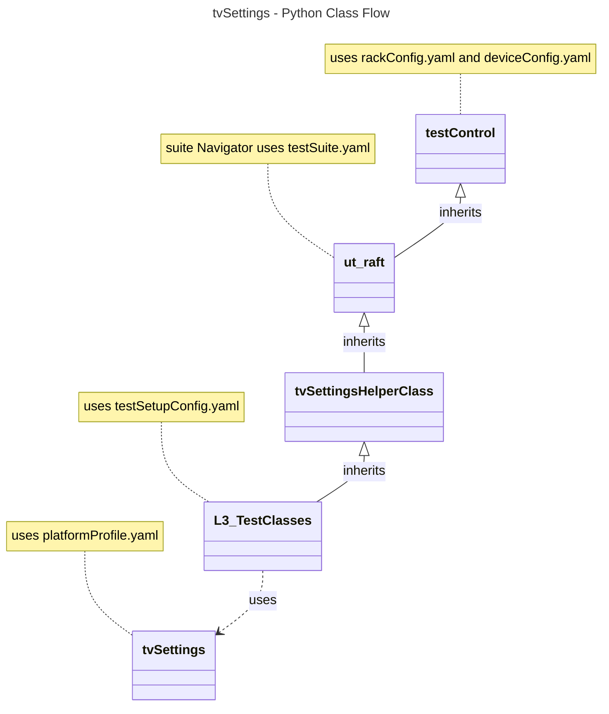

# `TV` Settings L3 Low Level Test Specification and Procedure Documentation

## Table of Contents

- [Overview](#overview)
- [Acronyms, Terms and Abbreviations](#acronyms-terms-and-abbreviations)
- [References](#references)
- [Level 3 Test cases High Level Overview](#level-3-test-cases-high-level-overview)
- [Level 3 Python Test Cases High Level Overview](#level-3-python-test-cases-high-level-overview)

## Overview

This document describes the L3 Low Level Test Specification and Procedure Documentation for the `TV` Settings module.

### Acronyms, Terms and Abbreviations

- `HAL`  \- Hardware Abstraction Layer, may include some common components
- `UT`   \- Unit Test(s)
- `OEM`  \- Original Equipment Manufacture
- `SoC`  \- System on a Chip
- `HDMI` \- High-Definition Multimedia Interface
- `HDCP` \- High-bandwidth Digital Content Protection
- `HDR`  \- High Dynamic Range
- `HLG`  \- Hybrid Log-Gamma
- `SDR`  \- Standard Dynamic Range
- `CMS`  \- Color Management System
- `TV`   \- TeleVision
- `RGB`  \- Red Green Blue
- `LDIM` \- Local Dimming
- `Y`    \- yes supported
- `NA`   \- Not Supported

### References

- `High Level Test Specification` - [TV Settings High Level TestSpec](https://github.com/rdkcentral/rdkv-halif-test-tvsettings/blob/2.0.0/docs/pages/tv-settings_High_Level_Test_Spec.md)
- `Interface header` - [TV Settings HAL header](https://github.com/rdkcentral/rdkv-halif-tvsettings/blob/2.0.0/include/tvSettings.h)

## TvSettings Stream Requirement

|#|Streams Name|Streams description|
|-|------------|-------------------|
|1|vts_HDR10_stream|Format: HDR10,Resolution: 3840 x 2160 (4K UHD),Color Depth: 10-bit,Color Space: Rec. 2020|
|2|vts_SDR_stream|Format: SDR,Resolution: 1920 x 1080|
|3|vts_HLG_stream|Format: HLG,Resolution: 3840 x 2160 or It can also be used with 1080p and 720p resolutions.|
|4|vts_DolbyVision_stream|Format: Dolby Vision,Resolution: 3840 x 2160 (4K UHD),Color Depth: 10/12-bit,Color Space: Rec. 2020format and dynamic metadata.|
|5|vts_HDR10plus_stream|Format: HDR10,Resolution: 3840 x 2160 (4K UHD),Color Depth: 10-bit,Color Space: Rec. 2020 and dynamic metadata capabilities.|

## Level 3 Test Cases High Level Overview

Below are top test use-case for the `TV` Settings.

|#|Test-case|Description|HAL APIs|Source|Sink|Streams Number|
|-|---------|-----------|--------|------|----|--------------|
|1|Check VideoFormat|Verify the Video format by playing the pre defined stream with different video formats|`GetCurrentVideoFormat()`,`RegisterVideoFormatChangeCB()`|`N`|`Y`|1,2,3,4|
|2|Check VideoResolution|Verify the video Resolution by playing the pre defined stream different video Resolution|`GetCurrentVideoResolution()`,`RegisterVideoContentChangeCB()`|`N`|`Y`|1,2,3,4|
|3|Check VideoFrameRate|Verify the video Frame rate by playing the pre defined stream different video Frame rate|`GetCurrentVideoFrameRate()`,`RegisterVideoResolutionChangeCB()`|`N`|`Y`|1,2,3,4|
|4|Check Video Source|Verify the current video source of the `TV` settings. It should return the default IP, as we are testing with the IP module only.|`GetCurrentVideoSource()`, `RegisterVideoFrameRateChangeCB()`|`N`|`Y`|1|
|5|Check Backlight for tvSettings|Play the pre-defined video and verify the backlight setting for `TV` settings. Valid range is from 0 to 100.|`GetBacklight()` `SetBacklight()`|`N`|`Y`|2|
|6|Check Backlight Fade for tvSettings|Play the pre-defined video and verify the backlight fade effect for `TV` settings. Valid range for from, to is 0 to 100 and duration range is from 0 to 1000|`GetBacklightFade()` `SetBacklightFade()`|`N`|`Y`|2|
|7|Check Backlight Mode for tvSettings|Play the pre-defined video and verify the backlight mode (manual, ambient, eco) for `TV` settings.|`GetCurrentBacklightMode()` `SetCurrentBacklightMode()`|`N`|`Y`|2|
|8|Verify `TV` Dimming Mode for tvSettings|Play the pre-defined video and verify the supported dimming mode(local, fixed, global) of the TV.|`GetTVDimmingMode()` `SetTVDimmingMode()`|`N`|`Y`|2|
|9|Check Local Dimming Mode for tvSettings|Play the pre-defined streams and verify the all supported local dimming mode (boost, non-boost, burst) for `TV` settings.|`GetLocalDimmingLevel()` `SetLocalDimmingLevel()`|`N`|`Y`|1,2,3,4|
|10|Set Brightness for tvSettings|Play the pre-defined streams and verify the brightness of `TV` settings. Valid range is from 0 - 100|`GetBrightness()` `SetBrightness()`|`N`|`Y`|2|
|11|Set Contrast for tvSettings|Play the pre-defined streams and verify the contrast of `TV` settings. Valid range is from 0 - 100|`GetContrast()` `SetContrast()`|`N`|`Y`|2|
|12|Set Sharpness for tvSettings|Play the pre-defined streams and verify the sharpness of `TV` settings. Valid range is from 0 - 100|`GetSharpness()` `SetSharpness()`|`N`|`Y`|2|
|13|Set Saturation for tvSettings|Play the pre-defined streams and verify the saturation of `TV` settings. Valid range is from 0 - 100|`GetSaturation()` `SetSaturation()`|`N`|`Y`|2|
|14|Set Hue for tvSettings|Play the pre-defined streams and verify the hue of `TV` settings. Valid range is from 0 - 100.|`GetHue()` `SetHue()`|`N`|`Y`|2|
|15|Set ColorTemperature for tvSettings|Play the pre-defined streams and verify the supported color temperature (standard, warm, cold, user, etc) of `TV` settings. Valid range is from 0 - 100|`GetColorTemperature()` `SetColorTemperature()`|`N`|`Y`|1|
|16|Verify Aspect Ratio for tvSettings|Play the pre-defined streams and verify the supported aspect ratio (16:9, 4:3 etc) setting of `TV` settings.|`GetAspectRatio()` `SetAspectRatio()`|`N`|`Y`|1,2,3,4|
|17|Check Dynamic Contrast for tvSettings|Play the pre-defined streams and verify the dynamic contrast setting by enabling/disabling of `TV` settings.|`GetDynamicContrast()` `SetDynamicContrast()`|`N`|`Y`|1|
|18|Check Dynamic Gamma for tvSettings|Play the pre-defined streams and verify the dynamic gamma setting (1.8 to 2.6) of `TV` settings.|`GetDynamicGamma()` `SetDynamicGamma()`|`N`|`Y`|1|
|19|Check Dolby Vision for tvSettings|Play the pre-defined streams and verify the supported (dark, bright, game etc) Dolby Vision mode of `TV` settings.|`GetTVDolbyVisionMode()` `SetTVDolbyVisionMode()`|`N`|`Y`|4|
|20|Check Picture Mode for tvSettings|Play the pre-defined streams and verify the picture mode (standard, vivid, energy saving, custom, theater, game, sports etc) setting of `TV` settings.|`GetTVPictureMode()` `SetTVPictureMode()`|`N`|`Y`|2|
|21|Check ColorTempRgain for tvSettings|Play the pre-defined streams and verify the red gain value (0 - 2047) for color temperature in `TV` settings.|`GetColorTemp_Rgain_onSource()` `SetColorTemp_Rgain_onSource()`|`N`|`Y`|1|
|22|Check ColorTempGgain for tvSettings|Play the pre-defined streams and verify the green gain value (0 - 2047) for color temperature in `TV` settings.|`GetColorTemp_Ggain_onSource()` `SetColorTemp_Ggain_onSource()`|`N`|`Y`|1|
|23|Check ColorTempBgain for tvSettings|Play the pre-defined streams and verify the blue gain value(0-2047) for color temperature in `TV` settings.|`GetColorTemp_Bgain_onSource()` `SetColorTemp_Bgain_onSource()`|`N`|`Y`|2|
|24|Verify ColorTempRpostoffset for tvSettings|Verify the Rpost offset by setting the value(-1024 to 1023) for color temperature in `TV` settings.|`GetColorTemp_R_post_offset_onSource()` `SetColorTemp_R_post_offset_onSource()`|`N`|`Y`|`NA`|
|25|Verify ColorTempGpostoffset for tvSettings|Verify the Gpost offset by setting the value(-1024 to 1023) for color temperature in `TV` settings.|`GetColorTemp_G_post_offset_onSource()` `SetColorTemp_G_post_offset_onSource()`|`N`|`Y`|`NA`|
|26|Verify ColorTempBpostoffset for tvSettings|Verify the Bpost offset by setting the value(-1024 to 1023) for color temperature in `TV` settings.|`GetColorTemp_B_post_offset_onSource()` `SetColorTemp_B_post_offset_onSource()`|`N`|`Y`|`NA`|
|27|Verify WBCalibrationMode for tvSettings|Play the predefined stream and verify the white balance calibration mode by enabling/disabling in `TV` settings.|`EnableWBCalibrationMode()` `GetCurrentWBCalibrationMode()`|`N`|`Y`|2|
|28|Check Gamma Table for tvSettings|Play the predefined streams and then verify the gamma table functionality. Valid range for RGB array is 0-1023 and size is 0-256.|`GetGammaTable()` `SetGammaTable()`|N|Y|1,2|
|29|Verify DvTmaxValue for tvSettings|Verify the Dolby Vision maximum brightness value in TV settings. Play the predefined streams and then verify the DvTmax value functionality. Valid range is from 0-10000|`GetDvTmaxValue()` `SetDvTmaxValue()`|N|Y|4|
|30|Verify ComponentSaturation for tvSettings|Set the CMS state, play the predefined streams and then verify the component saturation functionality. Valid range is from 0-100|`SetCMSState()` `GetCurrentComponentSaturation()` `SetCurrentComponentSaturation()`|N|Y|1|
|31|Verify ComponentHue for tvSettings|Set the CMS state, play the predefined streams and then verify the component hue functionality. Valid range is from 0-100|`SetCMSState()` `GetCurrentComponentHue()` `SetCurrentComponentHue()`|N|Y|1|
|32|Verify ComponentLuma for tvSettings|Set the CMS state, play the predefined streams and then verify the component luma functionality. Valid range is from 0-100|`SetCMSState()` `GetCurrentComponentLuma()` `SetCurrentComponentLuma()`|N|Y|1|
|33|Verify EnableGammaMode for tvSettings|Play the predefined streams and verify the gamma mode enable state by enabling/disabling in TV settings.|`EnableGammaMode()`|N|Y|1|
|34|SetGammaPattern for tvSettings|Play the predefined streams and verify the gamma pattern in TV settings. The RGB values are ranges for 0-1023 for 10-bit and 0-255 for 8-bit|`SetGammaPattern()`|N|Y|1|
|35|RGBPattern for tvSettings|Verify the RGB pattern in TV settings.|`SetRGBPattern()`|N|Y|NA|
|36|GrayPattern for tvSettings|Verify the gray pattern in TV settings.|`SetGrayPattern()`|N|Y|NA|
|37|EnableLDIMPixelCompensation for tvSettings|Play the predefined streams and verify the pixel compensation block by enabling/disabling.|`EnableLDIMPixelCompensation()`|N|Y|1|
|38|EnableLDIM for tvSettings|Play the predefined streams and verify the dimming module by enabling/disabling.|`EnableLDIM()`|N|Y|1|
|39|SetBacklightTestMode for tvSettings|Verify the backlight test mode setting (boost, burst, reset) in TV settings. Verify the functionality by playing the predefined streams.|`SetBacklightTestMode()`|N|Y|1|
|40|EnableDynamicContrast for tvSettings|Verify the dynamic contrast enable state in TV settings. Verify the functionality by playing the predefined streams.|`EnableDynamicContrast()`|N|Y|1|
|41|EnableLocalContrast for tvSettings|Verify the local contrast enable state in TV settings. Verify the functionality by playing the predefined streams.|`EnableLocalContrast()`|N|Y|1|
|42|Save Backlight values for tvSettings|Verify the saving of backlight values for TV settings. Play the predefined streams of one format, then switch to the saved video formats and verify the saving functionality.|`SaveBacklight()`|N|Y|1,2,3,4|
|43|Save TVDimming Mode values for tvSettings|Verify the saving of TVDimming values for TV settings. Play the predefined streams of one format, then switch to the saved video formats and verify the saving functionality.|`SaveTVDimmingMode()`|N|Y|1,2,3,4|
|44|Save LocalDimming Mode values for tvSettings|Verify the saving of LocalDimming values for TV settings. Play the predefined streams of one format, then switch to the saved video formats and verify the saving functionality.|`SaveLocalDimmingLevel()`|N|Y|1,2,3,4|
|45|Save Brightness values for tvSettings|Verify the saving of Brightness values for TV settings. Play the predefined streams of one format, then switch to the saved video formats and verify the saving functionality.|`SaveBrightness()`|N|Y|1,2,3,4|
|46|Save Contrast values for tvSettings|Verify the saving of Contrast values for TV settings. Play the predefined streams of one format, then switch to the saved video formats and verify the saving functionality.|`SaveContrast()`|N|Y|1,2,3,4|
|47|Save Sharpness values for tvSettings|Verify the saving of Sharpness values for TV settings. Play the predefined streams of one format, then switch to the saved video formats and verify the saving functionality.|`SaveSharpness()`|N|Y|1,2,3,4|
|48|Save Saturation values for tvSettings|Verify the saving of saturation values for TV settings. Play the predefined streams of one format, then switch to the saved video formats and verify the saving functionality.|`SaveSaturation()`|N|Y|1,2,3,4|
|49|Save Hue values for tvSettings|Verify the saving of hue values for TV settings. Play the predefined streams of one format, then switch to the saved video formats and verify the saving functionality.|`SaveHue()`|N|Y|1,2,3,4|
|50|Save ColorTemperature for tvSettings|Verify the saving of color temperature for TV settings. Play the predefined streams of one format, then switch to the saved video formats and verify the saving functionality.|`SaveColorTemperature()`|N|Y|1,2,3,4|
|51|Save Aspect Ratio for tvSettings|Verify the saving of aspect ratio for TV settings. Play the predefined streams of one format, then switch to the saved video formats and verify the saving functionality.|`SaveAspectRatio()`|N|Y|1,2,3,4|
|52|Save Low Latency State for tvSettings|Verify the saving of low latency state for TV settings. Play the predefined streams of one format, then switch to the saved video formats and verify the saving functionality.|`SaveLowLatency()`|N|Y|1,2,3,4|
|53|Save Dolby Vision mode for tvSettings|Verify the saving of Dolby Vision mode for TV settings. Play the predefined streams of one format, then switch to the saved video formats and verify the saving functionality.|`SaveDolbyVision()`|N|Y|1,2,3,4|
|54|Save Picture Mode for tvSettings|Verify the saving of picture mode for TV settings. Play the predefined streams of one format, then switch to the saved video formats and verify the saving functionality.|`SavePictureMode()`|N|Y|1,2,3,4|
|55|Save CMS State for tvSettings|Verify the saving of CMS state for TV settings. Play the predefined streams of one format, then switch to the saved video formats and verify the saving functionality.|`SavePictureMode()`|N|Y|1,2,3,4|

## Level 3 Python Test Cases High Level Overview

The class diagram below illustrates the flow of tvSettings L3 Python test cases:

- **testControl**
  - Test Control Module for running rack Testing. This module configures the `DUT` based on the rack configuration file provided to the test.
  - This class is defined in `RAFT` framework. For more details refer [RAFT](https://github.com/rdkcentral/python_raft/blob/1.0.0/README.md)
- **ut_raft**
  - Python based testing framework for writing engineering tests.
  - It provides common functionalities like menu navigation, configuration reader, reading user response etc.
  - For more details [ut-raft](https://github.com/rdkcentral/ut-raft).
- **tvSettings**
  - This is test helper class which communicates with the `L3` C/C++ test running on the `DUT` through menu
- **L3TestClasses**
  - These are the L3 test case classes
  - Each class covers the each test use-case defined in [L3 Test use-cases](#level-3-test-cases-high-level-overview) table

## YAML File Inputs

- **rackConfig.yaml**
  - Identifies the rack configuration and platform used
  - References platform-specific config from `deviceConfig.yaml`
  - For more details refer [RAFT](https://github.com/rdkcentral/python_raft/blob/1.0.0/README.md) and [example_rack_config.yml](https://github.com/rdkcentral/python_raft/blob/1.0.0/examples/configs/example_rack_config.yml)

- **deviceConfig.yaml**
  - Specifies overall configuration for the platform
  - Can be overridden by:
    - Changing locally .yaml file directory
    - Using --deviceConfig command line switch
  - For more details refer [RAFT](https://github.com/rdkcentral/python_raft/blob/1.0.0/README.md) and [example_device_config.yml](https://github.com/rdkcentral/python_raft/blob/1.0.0/examples/configs/example_device_config.yml)

- **componentProfile.yaml/platformProfile.yaml**
  - Contains component-specific configurations
  - Contains platform wide configuration broken down into separate components
  - Example configuration file [tvSettings](https://github.com/rdkcentral/rdkv-halif-test-tvsettings/blob/2.0.0/profiles/sink/Sink_4K_TvSettings.yaml)

- **testSetupConfig.yaml**
  - This configuration file contains the list of requirements for tests to execute. Eg: Copying the streams, setting environment variables etc.
  - Example configuration file [tvSettings_L3_testSetup.yml](../../host/tests/tvSettings_L3_Tests/tvSettings_L3_testSetup.yml)

- **testConfig.yaml**
  - This configuration file contains the list of menu items for C/C++ L3 test running on `DUT`
  - Example configuration file [tvSettings_testConfig.yml](../../host/tests/Classes/tvSettings_testConfig.yml)
  